# DanOverlay — osu!mania 4K Dan Estimation Overlay

**DanOverlay** is a real-time overlay for osu!mania 4K that estimates your Dan tier
as you select and play beatmaps. It connects to [tosu](https://tosu.app) to read
live game data, runs the [Sunny Star Rating Rebirth](https://github.com/kolhox/Star-Rating-Rebirth)
algorithm together with MinaCalc MSD skillsets, and displays the estimated Dan rank
through a lightweight HTML overlay using [pywebview](https://github.com/r0x0r/pywebview).

---

## Features

- **Real-time Dan estimation** — updates instantly when you switch maps or toggle mods
- **6 estimation modes:** Standard (Reform), Celestial, Signicial, Shoegazer, LN Course
- **20-tier Dan system** (1st–10th + Alpha–Kappa) with per-skillset SR rulers
- **Per-skillset classification** — automatically detects whether a map is jack, speed,
  stamina, tech, or hybrid and applies the optimal SR→DP ruler
- **Confidence scoring** — shows a range (e.g. "Alpha–Beta") when the estimate is uncertain
- **6 built-in skins** — Modern, Classic, Density Graph, Vertical Monolith, Broadcast Bar, Dark Vignette
- **Real-time audio visualizer** — FFT-based spectrum bars synced to playback
- **Chart export** — generates a PNG NPS/density chart and opens it on your Desktop
- **osu!lazer compatible** — reads custom clock rates (DT 1.5× → 2.0×, HT 0.5× → 0.75×)
- **Frameless mode** — borderless window overlay for OBS capture
- **Aspect-ratio lock** — toggleable fixed-width/height resize
- **Speedjack rescue** — automatic correction for peak-jack maps (Vertex Beta, etc.)
- **Marathon correction** — duration-based penalty for hybrid marathon maps

---

## Architecture

### System Architecture Flowcharts

#### Complete Data Flow Diagram

Full end-to-end flow: from osu! memory → tosu → analysis pipeline → overlay display.

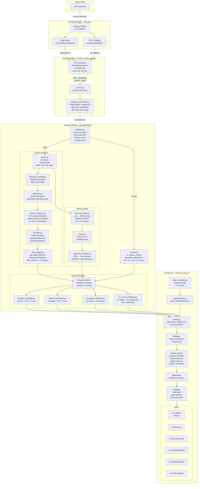

#### Pipeline Path Detail
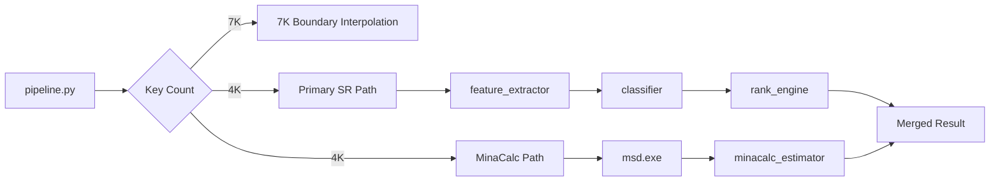

### Directory Structure

- **`src/02_runtime_bridge/`** — runtime data flow
  - `tosu_source.py` — Client that reads tosu JSON, emits events
  - `analysis_coordinator.py` — Single-worker scheduling, caches results, runs pipeline
  - `primary_sr_bridge.py` — Wraps Sunny SR algorithm.calculate() with native-rate interpolation
  - `parser.py` — .osu file parser
  - `validator.py` — Domain validation (note count, drain, LN)
- **`src/07_model/`** — estimation engine
  - `feature_extractor.py` — Extracts structural features from parsed
  - `classifier.py` — Family detection (jack/speed/stamina/…)
  - `rhythm_profile.py` — Pattern-based chart family classifier
  - `rank_engine.py` — SR→DP→Dan label (per-skillset rulers)
  - `minacalc_bridge.py` — Subprocess wrapper for msd.exe (MinaCalc)
  - `minacalc_estimator.py` — MSD→Dan (fallback path)
  - `*_estimator.py` — Celestial, Signicial, Shoegazer, LN
- **`src/03_engine_reference/`** — vendored Sunny engine
  - `sr_core/algorithm.py` — Sunny SR Rebirth engine (vendored, unmodified)
  - `sr_core/osu_file_parser.py` — .osu parser (vendored, patched for robustness)
- **`src/01_overlay_ui/`** — desktop overlay
  - `main.py` — Entry point, crash log, CLR fix
  - `overlay_host.py` — Window creation, Win32 API, skin loader
  - `bridge.py` — Python→JS event serialisation
  - `audio_service.py` — Bridges AudioVisualizer to event bus
  - `audio_visualizer.py` — FFT bands from decoded audio file
  - `chart_export.py` — NPS/density chart generator
  - `web/` — HTML/JS/CSS: 6 skins + chart renderer
  - `ffmpeg/` — Optional ffmpeg/ffprobe binaries (not hosted; see Dependencies)
- **`config/`**
  - `sr_means.json` — SR means per Dan (20 general + 4 skillsets)
  - `sr_means_7k.json` — SR means per Tier for 7K
  - `celestial_profiles.json` — 35 slots (7 tiers × 5 categories)
  - `signicial_profiles.json` — 18 Signicial stages
  - `shoegazer_profiles.json` — 12 Shoegazer stages
  - `ln_course_profiles.json` — 16 LN Course stages + OLS regression
  - `family_profiles.json` — Per-family classifier parameters
  - `role_scales.json` — Role weighting for MinaCalc path
  - `gates.json` — Domain validation & correction gates


### Data flow

1. **tosu** sends live game data via WebSocket (or HTTP fallback)
2. **tosu_source** reads the JSON, detects mods, and emits `MAP_CHANGED`
3. **analysis_coordinator** receives the event, debounces rapid switches (200 ms),
   checks its cache, and queues the map on a **single worker thread** that runs
   the **pipeline**
4. **pipeline** runs two parallel tasks:
   - Primary SR path: parse .osu → extract features → run Sunny SR algorithm
     → classify family → apply per-skillset SR ruler → DP + Dan label
   - MinaCalc path: subprocess to `msd.exe` → 7 skillset MSD values → Dan estimation
5. Results are merged (with marathon duration correction), enriched with
   Celestial/Signicial/Shoegazer/LN Course estimates, and emitted as `ANALYSIS_COMPLETE`
6. **bridge** serialises the result to JSON and calls `window.__overlayFromPython()`
   in the WebView, which updates the overlay display


#### Pipeline Internal Flow

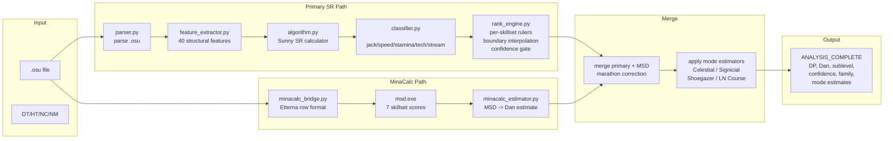

#### Rank Engine Detail

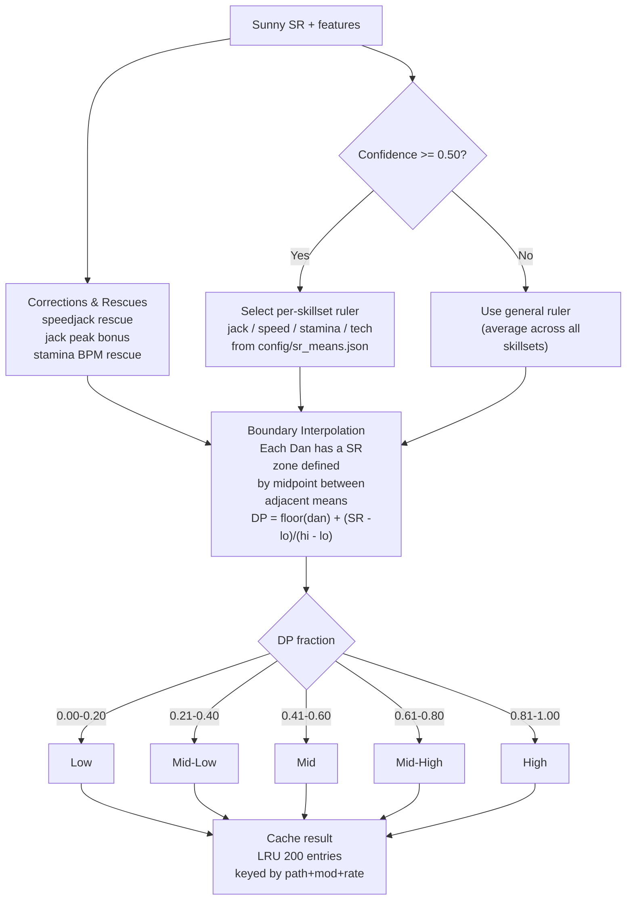

#### Overlay JS Rendering

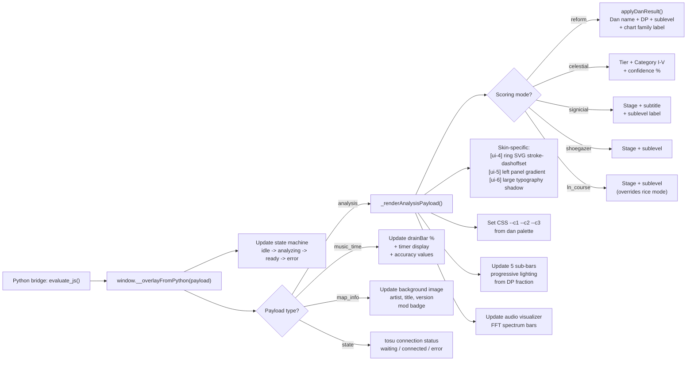

---

## Module reference

### Runtime (`src/02_runtime_bridge/`)

#### `tosu_source.py`
Connects to tosu (WebSocket preferred, HTTP fallback) and emits two event types:
- `MAP_CHANGED` — fired when the selected beatmap or active mod changes. Carries
  a `MapInfo` dataclass with metadata (artist, title, diff, mod speed, background
  image path, etc.)
- `MUSIC_TIME` — fired periodically during gameplay with current position, total
  time, playback speed, and accuracy values

Mod detection reads both osu!stable bit flags (`mods.num`) and osu!lazer's custom
clock rate (`mods.rate`). When a lazer custom rate is detected it overrides the
hardcoded 1.5× (DT) / 0.75× (HT) defaults.

#### `analysis_coordinator.py`
Listens for `MAP_CHANGED` and runs the analysis pipeline on a single worker thread.
Implements:
- **Single worker + debounce** — one analysis thread processes requests; rapid
  map switches are debounced 200 ms so only the last map is analysed
- **Result caching** by `(path, mod_label, mod_speed)` — revisiting a map or
  toggling mods is instant (200-entry LRU eviction)
- **Stale-result invalidation** — a monotonically increasing token prevents
  late-running analyses from overwriting newer map results on rapid switches
- **Warmup** — pre-imports numpy and sr_core in a background thread so the
  first analysis doesn't pay cold-start cost

#### `primary_sr_bridge.py`
Wraps `algorithm.calculate()` from the Sunny SR Rebirth engine. Caches SR results
by `(path, mtime, mod)`. Custom osu!lazer clock rates (anything other than the
native HT 0.75× / NM 1.0× / DT 1.5×) are linearly interpolated between the two
nearest native rates — this keeps SR monotonic in rate without modifying
`algorithm.py` itself.

#### `parser.py`
Parses `.osu` files in the `osu file format v2` (used by both osu!stable and
osu!lazer). Extracts hit objects, timing points, BPM, key count, OD, and metadata.
This is a custom parser independent of the vendored `osu_file_parser` in `sr_core/`.

#### `validator.py`
Validates the parsed domain for minimum note count (≥20), minimum drain time (≥5 s),
and LN ratio bands. Returns a confidence multiplier per LN band (high/degraded/gray/
out-of-domain).

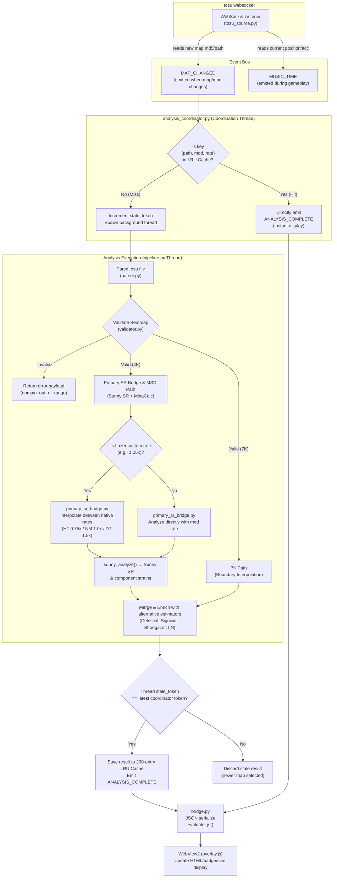

### Engine (`src/07_model/` + `src/03_engine_reference/`)

#### `sr_core/algorithm.py` (`src/03_engine_reference/sr_core/`)
The Sunny Star Rating Rebirth algorithm for osu!mania 4K. Computes a star rating
from note timing and column data using strain analysis with four component metrics:
- **Jbar** (Same-Column Pressure) — same-column density
- **Pbar** (Pressing Intensity) — overall pressing frequency
- **Xbar** (Cross-Column Pressure) — cross-column density
- **Abar** (Unevenness) — distribution irregularity

The SR is a weighted combination of high-percentile strain values with
logarithmic compression at the high end. This file is vendored from
[Star-Rating-Rebirth](https://github.com/kolhox/Star-Rating-Rebirth) and is
kept unmodified by this project.

#### `feature_extractor.py`
Extracts structural features from a parsed `.osu` file: stream purity, jack density,
density CV, transition variance, chord complexity, anchor ratio, NPS percentiles,
LN duration CV, and about 40 other metrics used by the classifier and corrections.

#### `classifier.py`
Classifies a map into one of 6 families: **jack**, **speed**, **stamina**, **tech**,
**stream**, or **hybrid**. Uses Sunny SR components (jbar, pbar, xbar, abar means)
combined with structural features from `feature_extractor.py`. The classifier also
detects tech subtypes (chaos / control / hybrid) for UI display.

The pipeline uses a **hybrid family classifier**: `rhythm_profile.py` (pattern-based
texture detection) is the primary source for mid-tier maps (SR < 7.0), with
`classifier.py` used as the bar-ratio fallback and for high-tier maps (SR ≥ 7.0).

Family detection includes a tiebreak rule: maps with >120s drain time AND
high chord fraction are forced to **stamina** to prevent marathon hybrid charts
from being misclassified as jack.

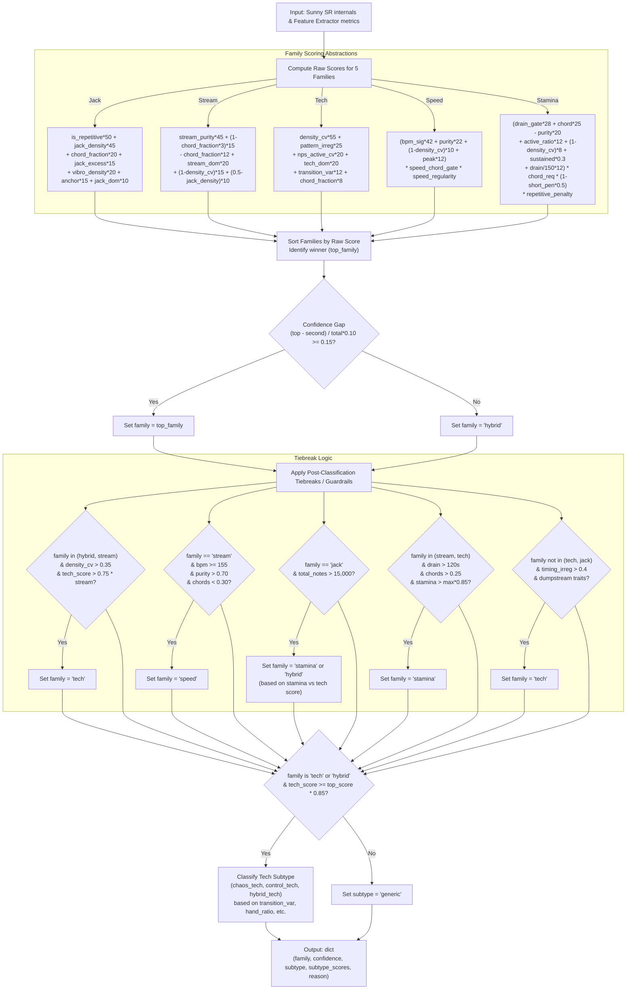

#### `rhythm_profile.py`
Pattern-based chart family classifier. Detects rhythmic textures (streams, jacks,
chords, coordination patterns) directly from the parsed note sequence instead of
Sunny SR component ratios — immune to SR compression at mid-tier levels. Primary
classifier for maps with SR < 7.0, with `classifier.py` as the high-tier fallback.

#### `rank_engine.py`
The core ranking engine. Converts Sunny SR to DP (Dan Points) using per-skillset
SR rulers calibrated from 1500+ maps:

1. **Ruler selection** — chooses the general ruler or a per-skillset ruler
   (jack/speed/stamina/tech) based on the classifier's family and confidence
2. **Boundary interpolation** — each Dan occupies a SR zone defined by midpoints
   between adjacent Dan mean SR values. Maps are interpolated linearly within
   each zone to produce a continuous DP value.
3. **DP = integer + fraction** — the integer part is the Dan number (Alpha = 11,
   Beta = 12, etc.), the decimal indicates position within that Dan.
4. **Speedjack rescue** — when jbar_max ≥ 70 AND jbar_share ≥ 0.55 AND
   pbar_max < 55, forces the jack ruler with a two-stage peak correction.
5. **Jack peak bonus** — additional SR compensation for peak-heavy jack charts
   where raw Sunny SR underrates the difficulty.

SR means are loaded from `config/sr_means.json` (20 general + 80 per-skillset values).
Monotonicity is enforced: each successive Dan must have a higher SR mean.

#### `minacalc_bridge.py`
Runs `msd.exe` (MinaCalc CLI) as a subprocess. Converts `.osu` hit objects to
Etterna row format and pipes them to msd.exe via stdin. Returns 7 skillset scores:
stream, jumpstream, handstream, stamina, jackspeed, chordjack, technical.

#### `minacalc_estimator.py`
Converts MinaCalc MSD scores to Dan estimates. Used as a fallback when the primary
SR path fails, and to feed the alternative mode estimators (Celestial, Signicial,
Shoegazer, LN Course).

#### `celestial_estimator.py`
Celestial Dan estimation (7 tiers × 5 categories = 35 slots). Uses SR boundary
interpolation with per-type rulers (jack/speed/stamina/tech) with shrinkage
toward the general mean. Maps SR to one of: Beginner, Intermediate, Expert,
Mastery, Ascension, Transcendence, Singularity (each subdivided I–V).

#### `signicial_estimator.py`
Signicial stage estimation (18 stages: I–X, Alpha–Theta). Same boundary
interpolation architecture as rank_engine, with per-type rulers and shrinkage.

#### `shoegazer_estimator.py`
Shoegazer stage estimation (12 stages: 1st–10th, Luminal, Tachyon).

#### `ln_course_estimator.py`
LN Course stage estimation (16 stages: 1st–10th, Yoake–Yokaze). Supports 4 LN
subfamilies (allround, jack_technical, inverse, speed_density). Uses SR boundary
interpolation followed by an OLS regression correction based on LN structural
features (hold occupancy, release density, duration CV, etc.).

### Overlay (`src/01_overlay_ui/`)

#### `main.py`
Entry point. Sets up:
- **Global exception hook** — writes `DanOverlay_error.txt` with full traceback
  for end-user debugging
- **PyInstaller CLR fix** — sets `PYTHONNET_PYDLL` and DLL search paths for
  frozen builds
- **Error dialog** — native Windows MessageBox when the overlay crashes before
  the window opens

#### `overlay_host.py`
Window launcher. Creates the pywebview window with:
- **6 skins** — reads `skin` from `%APPDATA%/DanOverlay/settings.json`
- **Frameless toggle** — Win32 `SetWindowLong` to remove/add title bar
- **Aspect-ratio lock** — subclasses the Win32 WndProc to intercept `WM_SIZING`
  and enforce width/height ratio
- **Overlay pin** — `SetWindowPos(HWND_TOPMOST)` to keep overlay above osu!
- **Audio visualizer** — starts `AudioService` on a background thread
- **Chart generation** — exposes `on_generate_chart` and `save_chart` to JS via
  `window.expose()`
- **WebView2 auto-detect** — scans registry and filesystem for the runtime
- **Skin switching** — `load_url()` to a different HTML file, then `resync()`

#### `bridge.py`
The sole Python→JS communication channel. Subscribes to all event bus events
and serialises them to JSON payloads sent via `window.evaluate_js()`:
- `map_info` — metadata, background image (base64 inline or fallback to tosu)
- `music_time` — playback position, accuracy
- `analysis` — DP, Dan label, sublevel, confidence, mode estimates
- `visualizer` — FFT band data for the audio spectrum
- `state` — overlay state transitions (idle/analyzing/ready/error)
- `notification` — user-facing messages

Also handles JS callbacks for chart saving and settings persistence.

#### `audio_service.py`
Bridges `AudioVisualizer` to the event-driven runtime. Listens for `MAP_CHANGED`
and `MUSIC_TIME` events, emits `AUDIO_BANDS` with FFT data for the spectrum
visualizer.

#### `audio_visualizer.py`
Downloads the current beatmap's audio file from tosu, decodes it with ffmpeg,
and computes real-time FFT bands at the current playback position. Runs in a
background thread with RMS-based silence gating.

#### `chart_export.py`
Generates NPS (notes per second) density charts as PNG images. Prepares the data
for the JS frontend to render via HTML/Canvas, then saves the result.

### Shared (`src/`)

#### `pipeline.py`
Orchestrates the full analysis. Runs two parallel tasks in a `ThreadPoolExecutor`:
- **Primary SR path**: parser → feature extractor → Sunny SR → classifier →
  rank_engine → DP
- **MinaCalc path**: msd.exe → 7 skillsets → Dan estimate

Merges results, applies the marathon duration correction,
and generates Celestial/Signicial/Shoegazer/LN Course estimates.

#### `contracts.py`
Canonical data contracts for the overlay runtime:
- `MapInfo` — metadata about the selected beatmap (md5, path, mods, times)
- `AnalysisResult` — structured output from one analysis pass (DP, label,
  confidence, mode estimates, debug info)
- State constants: `STATE_IDLE`, `STATE_WAITING_TOSU`, `STATE_ANALYZING`,
  `STATE_READY`, `STATE_WARNING`, `STATE_ERROR`

#### `events.py`
Minimal thread-safe publish/subscribe event bus. String-typed events:
`TOSU_STATUS`, `MAP_CHANGED`, `MUSIC_TIME`, `ANALYSIS_STARTED`,
`ANALYSIS_COMPLETE`, `ANALYSIS_ERROR`, `AUDIO_BANDS`, `NOTIFICATION`,
`OVERLAY_STATE`.

#### `resource_path.py`
Path resolver for development and PyInstaller frozen builds. In development mode
it walks up from the module file to the project root; in frozen mode it returns
`sys._MEIPASS`. All file access should go through this helper.

### Web frontend (`src/01_overlay_ui/web/`)

#### `overlay.js`
The overlay frontend (~4400 lines). Handles:
- **State machine** — transitions between `waiting_tosu`, `idle`, `analyzing`,
  `ready`, `warning`, `error`
- **Dan display** — animated Dan badge with label, sublevel, confidence meter
- **Skillset details** — expandable panel showing class probabilities, component
  breakdown, corrections
- **6 estimation modes** — Reform, Celestial, Signicial, Shoegazer, LN Course
- **Settings panel** — customizable display options (always on top, frameless,
  aspect ratio lock, UI scale, resize mode, color palette)
- **Skins** — toggle between all 6 skins (Modern, Classic, Density Graph, Vertical Monolith, Broadcast Bar, Dark Vignette)
- **Audio visualizer** — real-time FFT spectrum bars
- **Chart export** — renders NPS/density chart via a canvas-based renderer
- **Animations** — fade transitions, pulse effects, smooth badge updates
- **Keyboard shortcuts** — Tab (pin overlay), F1 (settings), F2 (reset window)

#### Skins

- **Modern** (`index.html` + `style.css`) — default vertical layout with gradient
  backgrounds, animated Dan badge, spectrum visualizer
- **Classic** (`ui-2/index.html` + `skin.css`) — horizontal layout, compact display
- **Density Graph** (`ui-3/index.html` + `style.css`) — includes a real-time
  density graph canvas alongside the Dan estimate
- **Vertical Monolith** (`ui-4/index.html` + `skin.css`) — SVG ring with radial
  gradient, sub-bars for DP fraction
- **Broadcast Bar** (`ui-5/index.html` + `skin.css`) — horizontal bar with colored
  left panel, compact streamer-friendly layout
- **Dark Vignette** (`ui-6/index.html` + `skin.css`) — floating big-type skin with
  dark anchor gradient, expanded stats drawer

#### `graph/chart_renderer.js`
Standalone canvas-based chart renderer. Injected into the WebView when the user
clicks "Export Chart". Draws NPS curve, strain graph, BPM markers, and map
metadata onto a high-resolution canvas, then sends the PNG data back to Python
for saving.

### Config files (`config/`)

| File | Contents |
|---|---|
| `sr_means.json` | SR→DP calibration data: 20 general means (official-only recalibrated) + 4×20 per-skillset means, calibrated from 146 official maps |
| `sr_means_7k.json` | SR means for the 15 7K tiers (0th–Stellium), general + per-skillset |
| `celestial_profiles.json` | SR means for all 35 Celestial slots (7 tiers × 5 categories) with per-type overrides |
| `signicial_profiles.json` | SR means for all 18 Signicial stages (I–Theta) with per-type overrides |
| `shoegazer_profiles.json` | SR means for all 12 Shoegazer stages (1st–Tachyon) |
| `ln_course_profiles.json` | SR means for 16 LN Course stages + OLS regression model for feature correction |
| `family_profiles.json` | Per-family classifier parameters (signal weights, correction bounds) |
| `role_scales.json` | Role aggregation weights for the MinaCalc path |
| `gates.json` | Domain validation thresholds, LN confidence bands, correction caps, sublevel labels |

---

## Estimation Systems

### 4K Reform Dan System

The overlay uses a 20-tier Dan system based on the official Reform Dan packs. Each dan has a **general SR mean** (used as fallback) and **per-skillset SR means** (jack, speed, stamina, tech) that are applied when the classifier is confident (≥50%).

Sublevel thresholds (inclusive upper bound): Low (0–20) · Mid-Low (21–40) · Mid (41–60) · Mid-High (61–80) · High (81–99)

| # | Dan | DP | General SR | Jack SR | Speed SR | Stamina SR | Tech SR |
|---|-----|----|------------|---------|----------|------------|---------|
| 1 | 1st Dan | 1.0–2.0 | 2.94 | 2.34 | 2.94 | 3.38 | 2.84 |
| 2 | 2nd Dan | 2.0–3.0 | 3.23 | 2.35 | 3.50 | 3.48 | 3.08 |
| 3 | 3rd Dan | 3.0–4.0 | 3.51 | 3.17 | 3.78 | 3.79 | 3.09 |
| 4 | 4th Dan | 4.0–5.0 | 4.16 | 3.48 | 4.16 | 4.69 | 3.90 |
| 5 | 5th Dan | 5.0–6.0 | 4.71 | 3.98 | 4.86 | 5.23 | 4.18 |
| 6 | 6th Dan | 6.0–7.0 | 5.12 | 4.75 | 5.29 | 5.65 | 4.50 |
| 7 | 7th Dan | 7.0–8.0 | 5.36 | 4.97 | 5.36 | 5.75 | 5.43 |
| 8 | 8th Dan | 8.0–9.0 | 5.83 | 5.84 | 5.71 | 6.15 | 5.69 |
| 9 | 9th Dan | 9.0–10.0 | 6.15 | 5.85 | 5.98 | 6.26 | 6.31 |
| 10 | 10th Dan | 10.0–11.0 | 6.55 | 6.50 | 6.22 | 6.41 | 6.46 |
| 11 | Alpha | 11.0–12.0 | 6.56 | 6.66 | 6.58 | 6.70 | 6.63 |
| 12 | Beta | 12.0–13.0 | 6.94 | 6.90 | 6.92 | 7.04 | 7.00 |
| 13 | Gamma | 13.0–14.0 | 7.41 | 7.28 | 7.23 | 7.37 | 7.31 |
| 14 | Delta | 14.0–15.0 | 7.91 | 7.91 | 7.91 | 8.04 | 7.99 |
| 15 | Epsilon | 15.0–16.0 | 9.03 | 9.13 | 9.25 | 9.32 | 9.22 |
| 16 | Zeta | 16.0–17.0 | 9.40 | 9.35 | 9.55 | 9.60 | 9.60 |
| 17 | Eta | 17.0–18.0 | 10.13 | 10.38 | 10.05 | 9.96 | 10.25 |
| 18 | Theta | 18.0–19.0 | 10.74 | 10.96 | 10.67 | 10.81 | 10.64 |
| 19 | Iota | 19.0–20.0 | 11.68 | 12.27 | 11.16 | 11.66 | 11.69 |
| 20 | Kappa | 20.0+ | 12.25 | 13.13 | 12.05 | 12.41 | 12.10 |

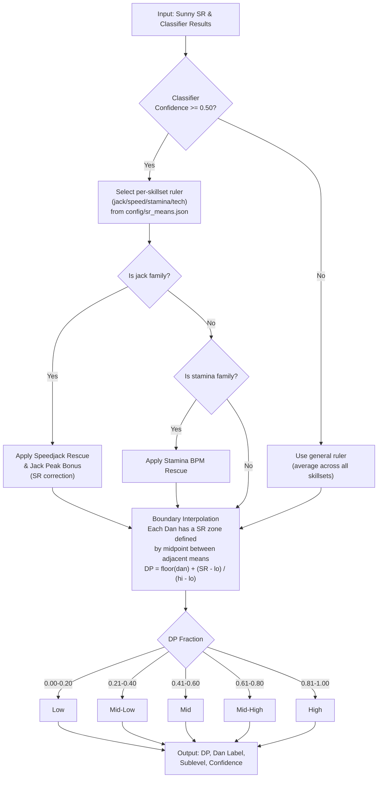

---

### 7K Dan System

Native support for 7K osu!mania maps with 15 tiers (0th–Stellium) calibrated from 7K dan packs (45 maps, 3 per tier). The pipeline runs a dedicated path: raw SR is computed via `algorithm.calculate()`, then mapped to a tier using boundary interpolation (midpoints between adjacent tier medians) — consistent with the 4K Reform system.

**Classification method:** Given a raw SR, find the boundary bracket whose midpoint boundaries contain the SR, then interpolate: `DP = tier_index + (SR - lo_boundary) / (hi_boundary - lo_boundary)`. Sublevels use symmetric 20% thresholds (Low, Mid-Low, Mid, Mid-High, High), same as all other modes.

#### General 7K SR Means

| Tier | DP Base | Median SR | Mean SR | Min SR | Max SR | Maps (n) |
|------|---------|-----------|---------|--------|--------|----------|
| 0th | 0.0 | 3.7392 | 3.7037 | 3.3056 | 4.0664 | 3 |
| 1st | 1.0 | 4.7131 | 4.6596 | 4.2308 | 5.0348 | 3 |
| 2nd | 2.0 | 4.9136 | 5.1143 | 4.7514 | 5.6780 | 3 |
| 3rd | 3.0 | 5.4499 | 5.4877 | 5.1288 | 5.8844 | 3 |
| 4th | 4.0 | 5.8615 | 5.8614 | 5.5744 | 6.1483 | 3 |
| 5th | 5.0 | 6.0782 | 6.1033 | 5.9730 | 6.2587 | 3 |
| 6th | 6.0 | 6.4382 | 6.5724 | 6.2160 | 7.0631 | 3 |
| 7th | 7.0 | 6.9917 | 6.9788 | 6.7263 | 7.2184 | 3 |
| 8th | 8.0 | 7.6337 | 7.5220 | 7.1528 | 7.7794 | 3 |
| 9th | 9.0 | 7.6437 | 7.7837 | 7.4582 | 8.0920 | 3 |
| 10th | 10.0 | 8.2582 | 8.2658 | 7.9061 | 8.6330 | 3 |
| Gamma (11th) | 11.0 | 8.7916 | 8.6916 | 8.3442 | 8.9389 | 3 |
| Azimuth (12th) | 12.0 | 9.2473 | 9.2493 | 9.1104 | 9.3902 | 3 |
| Zenith (13th) | 13.0 | 9.9851 | 9.9485 | 9.8685 | 9.9918 | 3 |
| Stellium (14th) | 14.0 | 10.5680 | 10.4853 | 10.2731 | 10.6147 | 3 |

Maps below 0th → "Below 0th" (DP < 0.0). Maps above Stellium → "Beyond Stellium" (DP > 15.0).

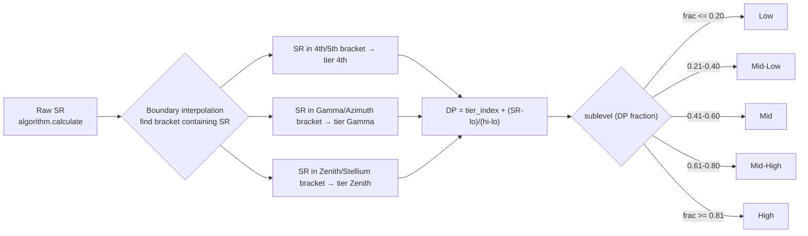

---

### Shoegazer
12-stage system (1st–10th, Luminal, Tachyon). Calibrated from Shoegazer Dan packs.

| Stage | SR Mean | SR Range (Min – Max) | Overall MSD | MSD Range (Min – Max) | Maps (n) |
|-------|---------|----------------------|-------------|-----------------------|----------|
| 1st | 3.1267 | 3.1267 – 3.1267 | 14.8740 | 14.8740 – 14.8740 | 1 |
| 2nd | 3.5070 | 3.5070 – 3.5070 | 17.1051 | 17.1051 – 17.1051 | 1 |
| 3rd | 3.9562 | 3.9562 – 3.9562 | 18.1818 | 18.1818 – 18.1818 | 1 |
| 4th | 4.6767 | 4.6767 – 4.6767 | 20.7681 | 20.7681 – 20.7681 | 1 |
| 5th | 4.9451 | 4.9451 – 4.9451 | 21.5229 | 21.5229 – 21.5229 | 1 |
| 6th | 5.5769 | 5.5769 – 5.5769 | 23.7762 | 23.7762 – 23.7762 | 1 |
| 7th | 5.6621 | 5.5689 – 5.7553 | 24.2646 | 24.0537 – 24.4755 | 2 |
| 8th | 6.0305 | 6.0012 – 6.0597 | 24.9806 | 24.9306 – 25.0305 | 2 |
| 9th | 5.9935 | 5.9820 – 6.0050 | 25.6022 | 25.5078 – 25.6965 | 2 |
| 10th | 6.6190 | 6.5946 – 6.6434 | 26.5345 | 26.4291 – 26.6400 | 2 |
| Luminal | 7.0461 | 7.0321 – 7.0602 | 28.1662 | 27.5946 – 28.7379 | 2 |
| Tachyon | 7.5711 | 7.4949 – 7.7039 | 29.7369 | 28.7712 – 30.6693 | 3 |

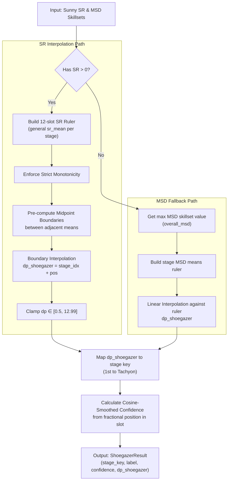

### Celestial
35-slot system (7 tiers × 5 categories I–V). Uses SR boundary interpolation with per-type ruler shrinkage toward the general mean.

| Tier | Tier I SR | Tier II SR | Tier III SR | Tier IV SR | Tier V SR |
|------|---------------|----------------|-----------------|----------------|---------------|
| Beginner | 0.3521 | 0.4778 | 1.1373 | 1.8640 | 2.1939 |
| Intermediate | 2.3688 | 2.7081 | 2.9057 | 3.2388 | 3.6187 |
| Expert | 3.7680 | 4.3309 | 4.5624 | 4.5416 | 4.6808 |
| Mastery | 5.1045 | 5.3629 | 5.7535 | 5.7191 | 5.9995 |
| Ascension | 6.0801 | 6.5801 | 6.8393 | 6.9687 | 7.3377 |
| Transcendence | 7.4964 | 7.8092 | 8.0300 | 8.3215 | 8.5645 |
| Singularity | 8.8056 | 8.9126 | 9.4519 | 9.8404 | 10.0878 |

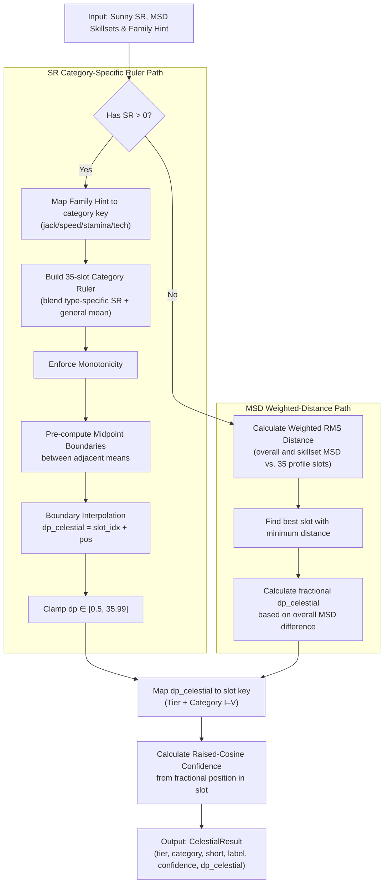

### Signicial
18-stage system (I–XIV + 4 Extra Stages). Calibrated from Signicial Dan packs.

| Stage Key     | Display Name | Subtitle (Stages I-X) | SR Mean | SR Range (Min – Max) | Overall MSD | Maps (n) |
| ---------------| --------------| -----------------------| ---------| ----------------------| -------------| ----------|
| I             | Stage I      | Prelude               | 2.6840  | 1.9220 – 3.0910      | 14.4040     | 4        |
| II            | Stage II     | Abnormality           | 2.9170  | 2.4400 – 3.2530      | 14.6340     | 4        |
| III           | Stage III    | Termination           | 3.3740  | 2.7400 – 3.7680      | 16.1590     | 4        |
| IV            | Stage IV     | Resuscitation         | 3.9750  | 3.6180 – 4.3560      | 18.5230     | 4        |
| V             | Stage V      | Disturbance           | 4.3410  | 3.9230 – 4.7470      | 19.5500     | 4        |
| VI            | Stage VI     | Revitalization        | 4.6610  | 4.4420 – 5.0650      | 20.2360     | 4        |
| VII           | Stage VII    | Motivation            | 5.0060  | 4.8060 – 5.2960      | 21.5980     | 4        |
| VIII          | Stage VIII   | Misfortune            | 5.3020  | 5.0720 – 5.6830      | 22.8840     | 4        |
| IX            | Stage IX     | Catastrophe           | 5.6050  | 5.3300 – 5.8440      | 23.8680     | 4        |
| X             | Stage X      | Finale                | 5.9780  | 5.7350 – 6.2220      | 24.5880     | 4        |
| XI            | Alpha        | —                     | 6.3020  | 6.2300 – 6.4420      | 26.3330     | 4        |
| XII           | Beta         | —                     | 6.6440  | 6.4640 – 6.9570      | 26.7640     | 4        |
| XIII          | Gamma        | —                     | 7.2420  | 6.7190 – 7.6370      | 29.6740     | 4        |
| XIV           | Delta        | —                     | 7.9650  | 7.9010 – 8.0480      | 31.6280     | 4        |
| LastStage     | Epsilon      | —                     | 8.9280  | 8.7340 – 9.2510      | 32.7160     | 4        |
| ExtraStageI   | Zeta         | —                     | 9.5163  | 8.9814 – 9.7821      | 37.5800     | 4        |
| ExtraStageII  | Eta          | —                     | 9.9816  | 9.3905 – 10.3899     | 41.0000     | 4        |
| ExtraStageIII | Theta        | —                     | 10.8000 | 10.4700 – 11.1300    | 45.0000     | 4        |

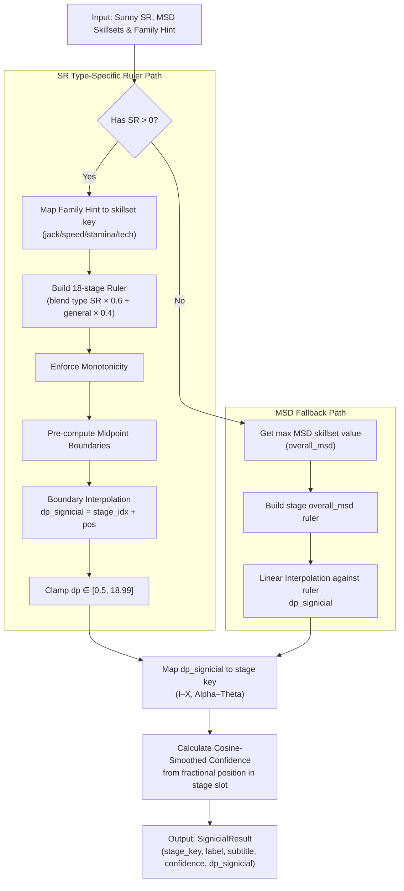

### LN Course
16-stage system (1st–10th, Yoake–Yokaze). Combines SR boundary interpolation with an OLS regression that adjusts the estimate based on LN-specific structural features (hold occupancy, release density, LN duration CV, simultaneous hold). Supports 4 LN subfamilies: allround, jack_technical, inverse, speed_density.

| Stage | Global SR Mean | Allround SR Mean | Jack Technical SR Mean | Inverse SR Mean | Speed Density SR Mean |
|-------|----------------|------------------|------------------------|-----------------|-----------------------|
| 1st | 1.3050 | 2.3246 | 0.9170 | 0.3730 | 1.6052 |
| 2nd | 2.1515 | 1.7897 | 2.1146 | 1.6848 | 3.0169 |
| 3rd | 2.8504 | 2.7561 | 3.5099 | 2.3061 | 3.4553 |
| 4th | 2.8504 | 2.6084 | 2.9725 | 1.6863 | 3.5086 |
| 5th | 3.2971 | 3.4770 | 3.0857 | 3.4617 | 3.5691 |
| 6th | 3.2971 | 3.1132 | 1.9911 | 3.1251 | 4.5535 |
| 7th | 3.8084 | 4.1950 | 3.6810 | 2.2816 | 5.0759 |
| 8th | 3.9410 | 4.4407 | 2.8157 | 3.4850 | 5.0227 |
| 9th | 4.5798 | 4.9033 | 3.9959 | 4.3624 | 5.0577 |
| 10th | 5.0721 | 5.5391 | 4.7784 | 4.4354 | 5.5354 |
| Yoake | 5.3570 | 5.7238 | 4.0904 | 5.9052 | 5.7086 |
| Yuugure | 5.7562 | 6.0091 | 5.0529 | 5.9866 | 5.9762 |
| Yoru | 6.4753 | 6.3930 | 6.0788 | 6.8257 | 6.6037 |
| Yami | 6.8382 | 6.8910 | 7.0452 | 6.4333 | 6.9833 |
| Yume | 7.1861 | 7.4672 | 6.9865 | 7.1386 | 7.1522 |
| Yokaze | 7.5488 | 6.9452 | 7.5334 | 7.3977 | 8.3187 |

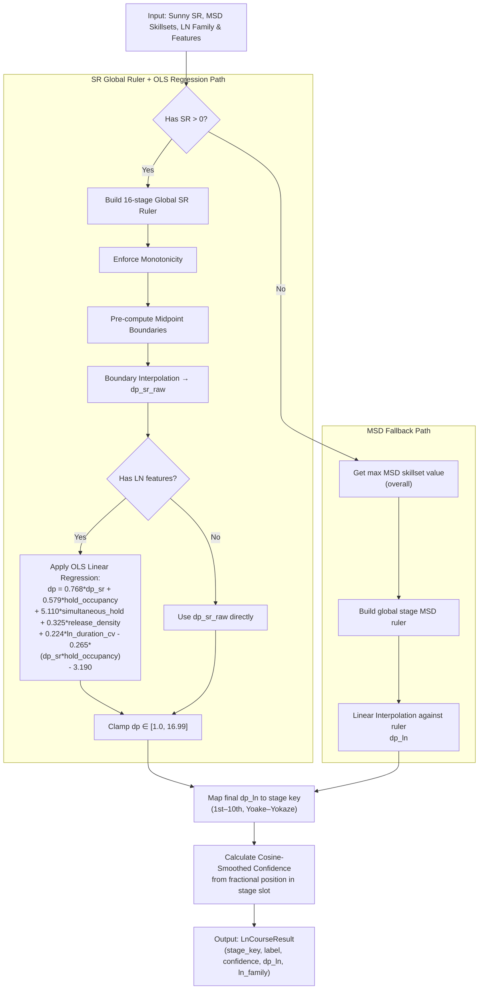

---

## Build

### Dependencies

- Python ≥ 3.12
- See `src/04_packaging_and_launch/requirements.txt` for pip packages
- WebView2 Runtime (Windows) — auto-detected, download from Microsoft if missing
- `tools/bin/msd.exe` — MinaCalc CLI binary (included in the repository)
- ffmpeg/ffprobe — for the audio visualizer; the overlay looks for them next to
  the executable, then falls back to PATH. Download from https://ffmpeg.org

### Development

```bash
# Create virtual environment and install
python -m venv .venv
.venv\Scripts\pip install -r requirements.txt

# Run in development mode
.venv\Scripts\python src/01_overlay_ui/main.py
```

### Packaging (PyInstaller)

```bash
# Single-file executable
build.bat

# Debug build (--onedir, faster compile)
build.bat --dev
```

The build script validates that all required files exist (config JSONs, msd.exe,
ffmpeg, web assets) before compiling.

---

## Usage

1. Install [tosu](https://tosu.app) and launch it
2. Launch the DanOverlay executable (or run `main.py` in dev mode)
3. Select a beatmap in osu! — the overlay shows the estimated Dan in real time
4. Press **Tab** to pin/unpin the overlay above osu!
5. Press **F1** to open settings, **F2** to reset window size

### Mod support

| Mod | Behaviour |
|-----|-----------|
| DT / NC | 1.5× speed (stable); custom 1.01×–2.0× (lazer) |
| HT | 0.75× speed (stable); custom 0.5×–0.99× (lazer) |
| Other mods | No timing effect on SR calculation |

---

## Acknowledgements

- **Sunny** — Star Rating Rebirth: the main difficulty engine powering the overlay
- **Signicial** — Authorised use of the Signicial Dan scale in the overlay
- **Etterna MSD** — Difficulty skillset ratings used for visualisation and chart generation
- **tosu** — Real-time osu! data source

---

*Author: 8DOUL (Discord: agent_ale)*
