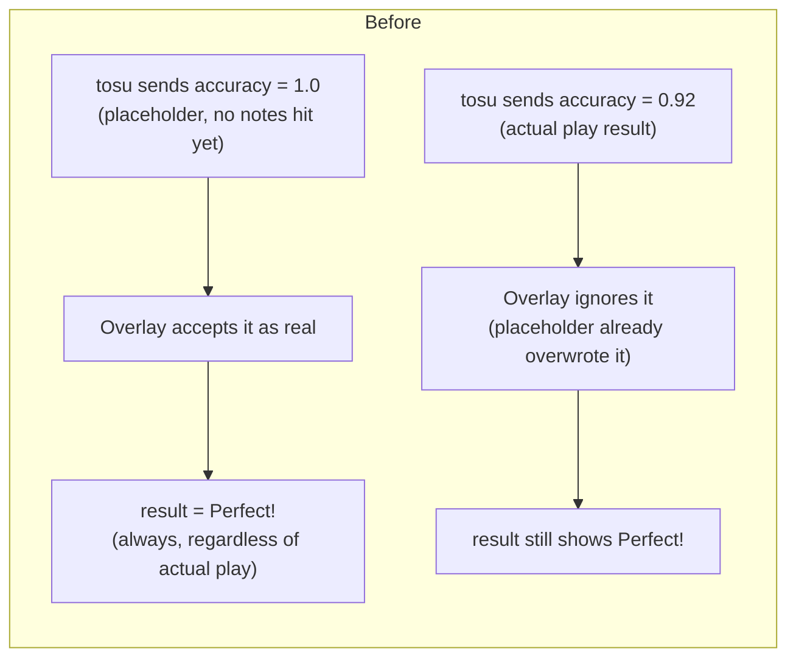
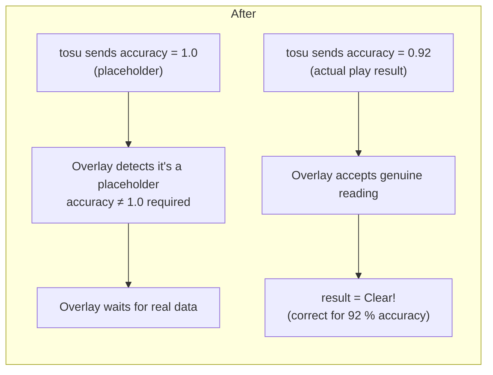

# DanOverlay 2.1.1 — Accuracy Display Fix

## Problem

After finishing a play, the result text always displayed "Perfect!" regardless of the player's actual accuracy. This happened in all game modes (Reform, Celestial, Signicial, etc.).

## Root Cause

A real-time data source initialises the accuracy field to 1.0 (100 %) as a placeholder value before the first note is hit. The overlay was accepting this placeholder and treating it as a real reading, causing every play to show "Perfect!" even when the actual accuracy was far lower.

## Fix Applied

1. **During gameplay**: placeholder accuracy values of exactly 1.0 are now ignored, so the overlay waits for genuine accuracy updates.
2. **On the results screen**: the final accuracy is only read from the definitive results source when no real gameplay value was recorded.
