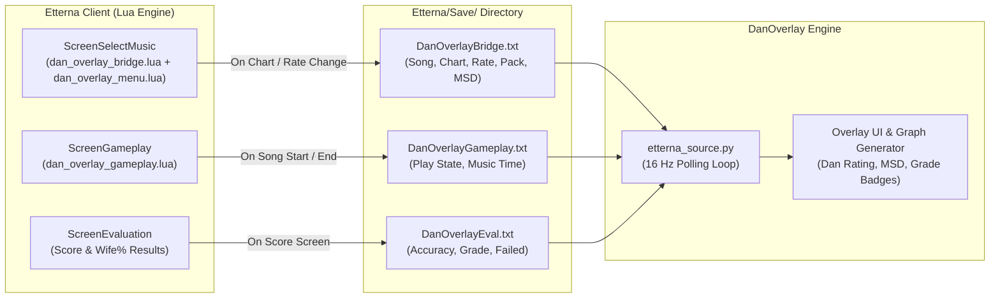

# Etterna Integration Guide for DanOverlay

DanOverlay connects universally and **theme-independently** with Etterna through 3 lightweight Lua integration actors that emit state updates to the game's `Save/` directory.

---

## 1. How the Etterna Bridge Works

Unlike osu!mania which relies on memory reading via `tosu.app`, Etterna communicates with DanOverlay via **non-invasive file-based IPC**:



### The Three Lua Bridge Actors:
1. **`dan_overlay_bridge.lua`** (`ScreenSelectMusic`):
   - Triggers whenever a song, difficulty, or rate is changed.
   - Extracts metadata: Song Title, Artist, Song Directory, Step File Path, Difficulty, Meter, Rate Multiplier, and native Etterna MSD skillset ratings.
   - Writes `Save/DanOverlayBridge.txt`.
2. **`dan_overlay_menu.lua`** (`ScreenSelectMusic`):
   - Keeps rate and wheel settlement in sync during rapid song-wheel scrolling without lagging the UI.
   - Writes `Save/DanOverlayMenu.txt`.
3. **`dan_overlay_gameplay.lua`** (`ScreenGameplay` & `ScreenEvaluation`):
   - **Zero In-Game Overhead**: Performs exactly 2 disk writes per session (1 at song start, 1 at song finish) — **0 CPU work and 0 disk writes** while notes are falling.
   - Emits live play status, music timestamp, final Wife% accuracy, pass/fail status, and official Etterna grade (`F` through `AAAAA`).
   - Writes `Save/DanOverlayGameplay.txt` and `Save/DanOverlayEval.txt`.

---

## 2. Installation: Automatic & Manual Fallback

### A. Automatic Installation (Recommended)
DanOverlay includes an **automatic installer**:
- Whenever you launch DanOverlay while Etterna is installed or running, it automatically detects your active theme (e.g. `Til Death`, `Rebirth`, `_fallback`, etc.), copies the Lua bridge scripts into your theme directories, and safely injects the actor loader lines into `default.lua`.
- Automatic backups (`default.lua.dan_backup`) are created before any modifications.
- **No manual file copying is required under standard setups.**

---

### B. Manual Installation (Fallback for Custom / Modified Themes)
If you are using a heavily modified or non-standard custom theme where automatic detection did not inject the bridge lines, you can install the scripts manually:

1. Copy `dan_overlay_bridge.lua` and `dan_overlay_menu.lua` to:
   ```text
   Etterna/Themes/[YOUR_THEME]/BGAnimations/ScreenSelectMusic decorations/
   ```
   *(or `ScreenSelectMusic overlay/` depending on the theme structure)*

2. Open `default.lua` in that directory and add the following lines before `return t`:
   ```lua
   -- [DanOverlay Integration]
   t[#t+1] = LoadActor("dan_overlay_bridge.lua")
   t[#t+1] = LoadActor("dan_overlay_menu.lua")
   ```

3. Copy `dan_overlay_gameplay.lua` to:
   ```text
   Etterna/Themes/[YOUR_THEME]/BGAnimations/ScreenGameplay overlay/
   ```
   *(or `ScreenGameplay decorations/` depending on the theme structure)*

4. Open `default.lua` in that directory and add the following line before `return t`:
   ```lua
   -- [DanOverlay Integration]
   t[#t+1] = LoadActor("dan_overlay_gameplay.lua")
   ```

---

## 3. Universal Compatibility & Features

* **Supported Themes**: Rebirth, Til Death, Simply Love, Cyberia, Default, and all standard Etterna themes.
* **Supported Formats**: Simfiles `.sm` and `.ssc` (including split timing, custom BPMs, STOPS, and DELAYS) as well as `.osu`.
* **Automatic Rate Detection**: Smoothly scales difficulty ratings across all custom rates ($0.5\times \to 2.0\times$).
* **Evaluation Screen Capture**: Real-time Wife% accuracy computation, pass/fail detection, and grade badges (`F` to `AAAAA`).
* **Overlay Adaptation**: Omission of osu!-specific fields ($SR$, $OD$) when running under Etterna; audio visualizer disabled; density graph skin is not supported in Etterna mode.

---

## 4. Troubleshooting & Bug Reporting

> [!IMPORTANT]
> **Bug Reporting & Support:**  
> If you experience any theme-specific integration issues, if the automatic installer didn't inject the lines into your custom theme, or if you find any parsing anomalies with specific `.sm`/`.ssc` charts, please report them directly on **Discord** (or open an issue on the GitHub repository) with:
> - Your active Etterna theme name.
> - The song / simfile `.sm` / `.ssc` name.
> - Any relevant logs from DanOverlay or the Etterna console.

---

## 5. Acknowledgements & Credits

- **[JoseMGS3/DanielEtterna](https://github.com/JoseMGS3/DanielEtterna) by JoseMGS3** — Special thanks and credits for sharing his codebase, providing valuable knowledge, and serving as the primary architectural reference and inspiration for the Etterna Lua theme bridge connection mechanism.

