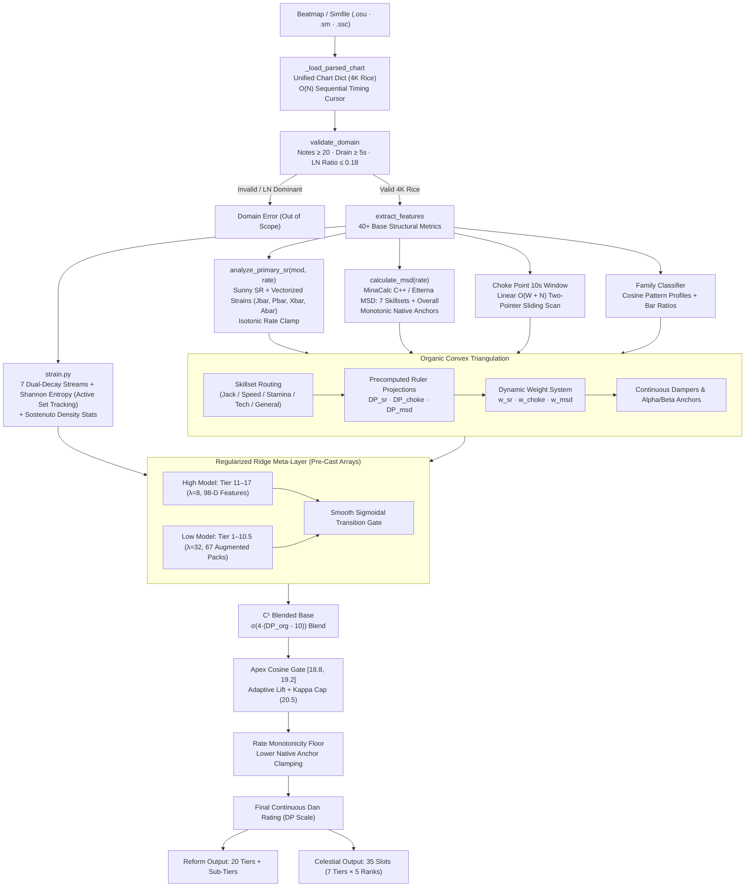
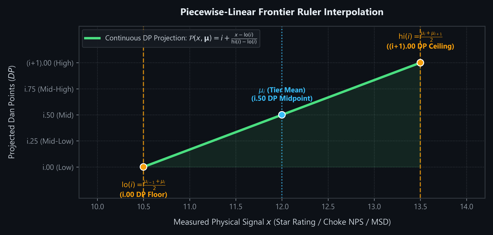
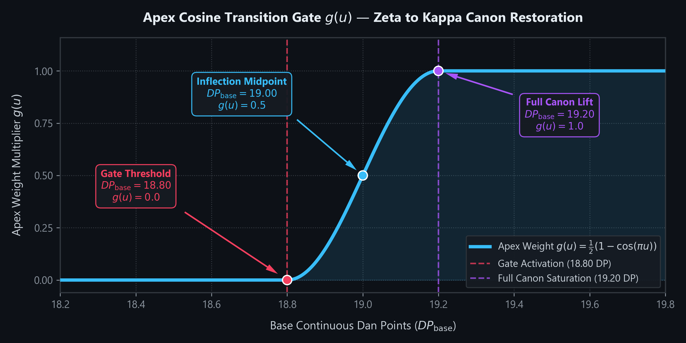
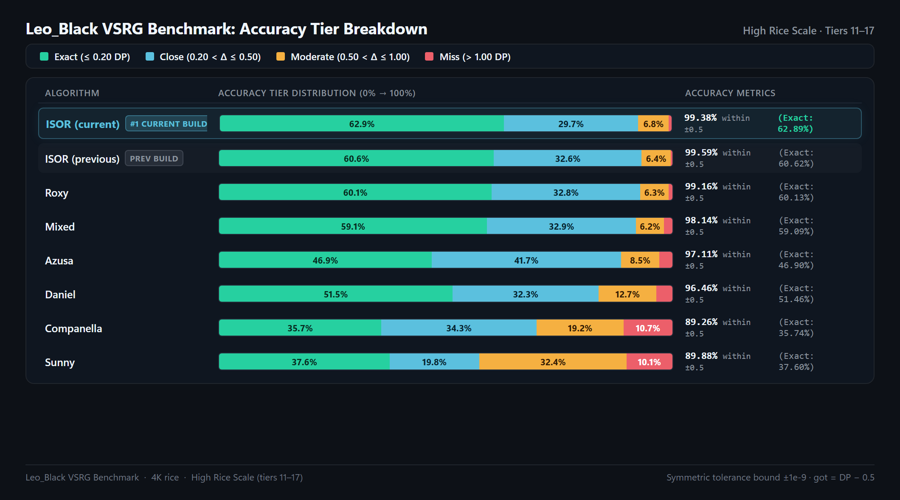
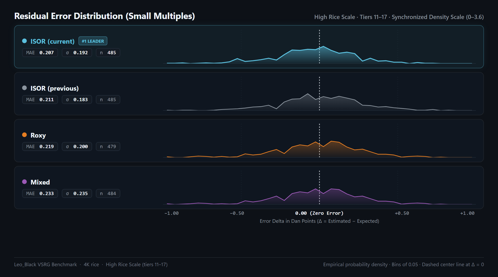
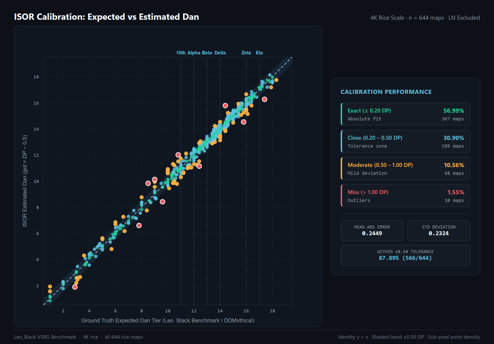
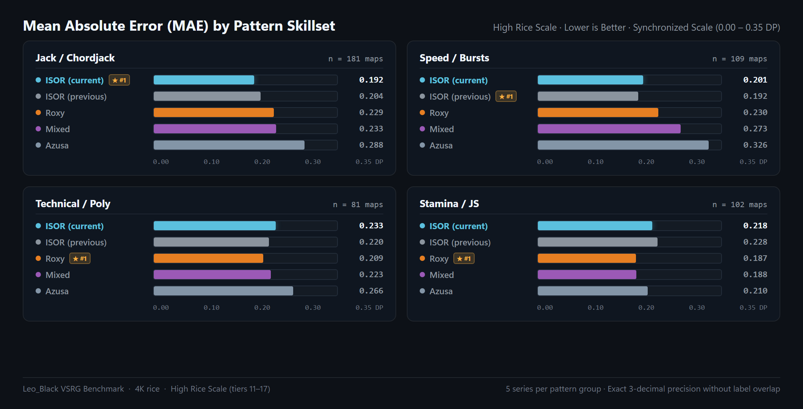
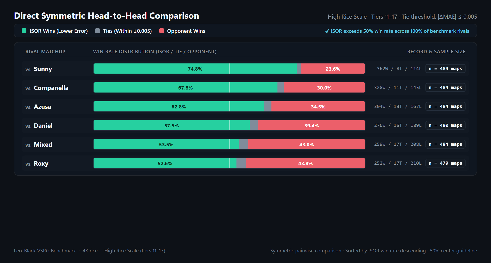

# ISOR — Isotonic Strain Organic Residual

**Next-Generation Dan & Difficulty Estimation Engine for DanOverlay (osu!mania 4K Rice).**

ISOR is an advanced, physiologically grounded difficulty estimation engine designed as an **alternate engine** for DanOverlay. Users can freely switch between the legacy engine and ISOR via the overlay settings panel. Both engines coexist seamlessly without breaking compatibility.

> [!IMPORTANT]
> **Operational Scope & Domain Boundaries**  
> ISOR is strictly calibrated and validated **exclusively for 4K rice beatmaps** (jacks, chordjacks, streams, speed bursts, stamina drains, technical patterns, and marathon courses).  
> - **Long Note (LN) maps are unsupported** and explicitly rejected based on LN ratio gating ($r_{\text{LN}} > 0.18$).  
> - **7K / non-4K keymodes are out of scope** (domain validation strictly enforces $K = 4$).  
> - Supported estimation scales are **Dan Reform** (20-tier continuous scale from 1st Dan to Kappa) and **Celestial** (35 discrete rank slots across 7 tiers). Legacy Signicial, Shoegazer, and LN Course ladders remain on legacy mode.

---

## Table of Contents

1. [The Acronym](#1-the-acronym)
2. [Core Design Philosophy](#2-core-design-philosophy)
3. [High-Level Architecture](#3-high-level-architecture)
4. [Execution Pipeline](#4-execution-pipeline)
5. [Mathematical & Algorithmic Foundations](#5-mathematical--algorithmic-foundations)
6. [Feature Vector Specification (98-D)](#6-feature-vector-specification-98-d)
7. [Estimation Modes & Tier Systems](#7-estimation-modes--tier-systems)
8. [Mod & Custom Rate Scaling (HT / DT / NC / Lazer)](#8-mod--custom-rate-scaling)
9. [Calibration, Benchmarking & Empirical Validation](#9-calibration-benchmarking--empirical-validation)
10. [Repository & Module Structure](#10-repository--module-structure)
11. [Architectural Guarantees](#11-architectural-guarantees)
12. [Known Limitations & Scope Constraints](#12-known-limitations--scope-constraints)
13. [Overlay Integration & Runtime Dispatch](#13-overlay-integration--runtime-dispatch)

---

## 1. The Acronym

The name **ISOR** embodies the four methodological pillars that drive its calculation pipeline:

| Pillar | Term | Technical Implementation in the Engine |
| :---: | :---: | :---|
| **I** | **Isotonic** | Calibration uses Pool Adjacent Violators Algorithm (**PAVA**) isotonic regression across difficulty rulers, paired with an isotonic rate clamp per beatmap that mathematically guarantees estimated SR never decreases with playback speed. All rating scales are strictly monotonic by construction. |
| **S** | **Strain** | Multi-layer biomechanical strain modeling: 7 distinct physical streams with dual exponential decay kernels (burst vs. sustain), rolling Shannon column/mask entropy, and weighted quantile aggregation to quantify physiological hand load. |
| **O** | **Organic** | An organic difficulty baseline constructed from the continuous convex triangulation of three human-aligned projections: modulated Star Rating ($DP_{\text{SR}}$), 10-second choke point density ($DP_{\text{choke}}$), and multi-skillset MinaCalc MSD ($DP_{\text{MSD}}$). |
| **R** | **Residual** | A regularized meta-corrector ($L_2$ Ridge) that estimates the subtle mathematical **residual** between the organic base and human consensus ratings. It operates strictly within reliable domain gates with continuous blending across low- and high-tier regimes. |

---

## 2. Core Design Philosophy

1. **Continuous Formulations, Zero Step Discontinuities:**  
   No heuristic corrections use brittle piecewise thresholds such as `if feature > X: +Y`. All boosts, gates, floors, and dampers are formulated as $C^0$/$C^1$ continuous functions (sigmoids, cosines, smooth clamps, and linear blends). This completely eliminates artificial difficulty cliffs.
2. **Human Consensus as Ground Truth:**  
   Calibrated against rigorous human-verified datasets: the Leo_Black VSRG Benchmark (746 beatmaps with verified expected Dans), official DDMythical Reform course packs (151 beatmaps), and official Celestial packs (160 beatmaps). No parameter is tuned arbitrarily.
3. **Verified Generalization Over Blind Overfitting:**  
   Every architectural iteration is validated using stratified K-Fold Cross-Validation and evaluated against independent external corpora (official packs and unseeded community practice sets). Generalization metrics are reported transparently.
4. **Strict Rate Monotonicity:**  
   A beatmap will **never** display a lower Dan rating when playback speed is increased ($\text{HT} \to \text{NM} \to \text{DT} \to \text{custom lazer rates}$), guaranteed through three independent architectural layers.
5. **Non-Destructive Coexistence:**  
   ISOR lives alongside the legacy model without overwriting existing workflows, allowing real-time comparative inspection.

---

## 3. High-Level Architecture



---

## 4. Execution Pipeline

### 4.1 Parsing & Domain Validation
The beatmap/simfile is parsed into the unified DanOverlay chart dictionary via `_load_parsed_chart`:
- **Supported Formats:** Native osu!mania (`.osu`) and Etterna (`.sm`, `.ssc`) charts.
- **Single-Pass Timing Resolution:** Simfiles are converted via an $O(N)$ sequential timing accumulator across BPM changes, STOPS, and DELAYS, achieving $<15\text{ ms}$ parse time on dense 50,000+ row charts.
- `validate_domain` enforces structural integrity ($K = 4$ columns):
  - **Minimum Note Count:** $N \ge 20$.
  - **Minimum Active Drain Duration:** $T_{\text{drain}} \ge 5.0\text{ s}$.
  - **Long Note Ratio:** $r_{\text{LN}} = N_{\text{LN}} / N \le 0.18$. Maps exceeding this threshold trigger a graceful `DomainError`.

### 4.2 Signal Ingestion
Five independent feature extractors process the note array simultaneously:
1. **Sunny Primary SR Bridge:** Extracts raw star rating $SR_{\text{raw}}$, peak strain components (Jbar, Pbar, Xbar: $\bar{J}, \bar{P}, \bar{X}$), and mean stream strain $\bar{A}$ (Abar) using batch-vectorized NumPy operations.
2. **MinaCalc MSD Subprocess:** Evaluates 7 core skillsets (Overall, Stream, Jumpstream, Handstream, Stamina, JackSpeed, Chordjack, Technical). For Etterna, utilizes direct native engine MSD.
3. **10-Second Choke Point Analyzer:** Computes rolling peak density $NPS_{10\text{s}}$, burst ratios, and local chord clusters in $O(W + N)$ linear time via two-pointer monotonic sliding window.
4. **Biomechanical Strain Module (`strain.py`):** Generates 7 physical strain streams, Shannon pattern entropy with active transition set tracking, and sustained density metrics.
5. **Pattern Classifier:** Identifies macro-families via cosine similarity against reference pattern profiles.

### 4.3 Skillset Routing

The map is mapped to a canonical skillset $\kappa \in \{\text{jack}, \text{speed}, \text{stamina}, \text{tech}, \text{general}\}$ as a **continuous mixture over the canonical rulers**: the classifier's family label selects the candidate rulers and every historical hard threshold (`jbar_max > 55`, `jack_density >= thr`, `jump_ratio >= thr`) is a sharp sigmoid, so a chart blends between skillsets instead of switching discretely and never jumps ruler when it crosses a value:

```python
# isor_engine.compute_triangulated_rank
_jbar_gate = _sigmoid(jbar_max, k=0.5, x0=55.0)
_jd_gate   = _sigmoid(jack_density, k=40.0, x0=_JD_JACK_THR)
if "jack" in fam_lower:
    sk_w = {"jack": 1.0}
elif "tech" in fam_lower:
    sk_w = {"jack": _jbar_gate, "tech": 1.0 - _jbar_gate}
else:
    _rescue = 1.0 - (1.0 - _jbar_gate) * (1.0 - _jd_gate)
    _t = _sigmoid(jump_ratio, k=12.0, x0=<threshold for this family>)
    sk_w = {_lo: (1.0 - _t) * (1.0 - _rescue), "stamina": _t * (1.0 - _rescue), "jack": _rescue}
# normalised to sum 1.0; dp_sr / dp_choke are the weighted blend of the skillset rulers
sk_key = max(sk_w, key=sk_w.get)   # dominant skillset, used for the lin_base coefficients
```

`sk_key` (the dominant weighted skillset) selects the `lin_base` coefficient set. A chart whose family resolves to `ln` is never scored by ISOR: the pipeline delegates it to the legacy LN/7K path rather than mixing LN behaviour into a rice estimate.

### 4.4 Continuous Ruler Projections
Each primary signal is projected onto continuous Dan Points ($DP$) via piecewise-linear frontier interpolation against calibrated skillset vectors:

$$
\begin{aligned}
DP_{\text{SR}} &= \mathcal{P}\left(SR_{\text{mod}}, \mathbf{\mu}_{\text{SR}}^{(\kappa)}\right) \\
DP_{\text{choke}} &= \mathcal{P}\left(NPS_{\text{choke}}, \mathbf{\mu}_{\text{choke}}^{(\kappa)}\right) \\
DP_{\text{MSD}} &= \mathcal{P}\left(MSD_{\text{overall}}, \mathbf{\mu}_{\text{MSD}}\right)
\end{aligned}
$$

### 4.5 Organic Convex Triangulation
The intermediate organic rating $DP_{\text{organic}}$ is computed via normalized convex combination:

$$
DP_{\text{organic}} = \frac{w_{\text{SR}} DP_{\text{SR}} + w_{\text{choke}} DP_{\text{choke}} + w_{\text{MSD}} DP_{\text{MSD}}}{w_{\text{SR}} + w_{\text{choke}} + w_{\text{MSD}}}
$$

> **Biomechanical layer (`strain.py`) is a feature supplier, not a fourth vector.**
> `_BIO_ENABLED` is `False`: the $w_{\text{bio}}\,DP_{\text{bio}}$ term is not part of the
> deployed triangulation. The 7 strain streams, their q97 peaks and the sustained-density
> statistics feed the Ridge meta-corrector instead (see §6).

### 4.6 Multi-Head Meta-Correction
To correct the residual error $y - DP_{\text{base}}$, three correction heads operate on the
standardized feature vector and are combined by smooth gates:

$$
\hat{\delta} = g_{\text{blend}} \cdot \Big[(1 - \alpha p)\,\hat{\delta}_{\text{high}} + \alpha p\,\hat{\delta}_{\text{mid}}\Big] + (1 - g_{\text{blend}}) \cdot \hat{\delta}_{\text{low}}
$$

- **High-tier head (Ridge, $\lambda = 8$):** trained on the benchmark band 11–17.5, $D = 98$.
- **Low-tier head (RBF lift + Ridge, $\lambda = 2$):** a Gaussian lift replaces the purely linear
  term on the lower band, $D = 99$ (the 98 structural features plus the row-transition entropy of
  §5.6). Its 163 centres are the maps of its own training population, so the correction is a smooth
  function of distance to real charts rather than a global linear fit. It remains $C^\infty$.
- **Mid head (Ridge, $\lambda = 16$) with a learned gate:** the blend gate hands charts with a high
  base level to the high-tier head even when their true tier is low, and that head was never trained
  on such charts. A third head is fitted on exactly that population, and a logistic weight
  $p(\mathbf{x}) \in [0,1]$ — fitted on the same features — decides per chart how much of it to
  apply. $D = 102$ (98 plus four texture/irregularity signals). No chart type, skillset, name or
  pack is ever consulted: the weight is a function of the features only.
- **Blend gate:** $\sigma\left(4.0 \cdot (DP_{\text{base}} - 10.0)\right)$.
- **Anchor calibration** (§4.7) is applied after this stack.
- The total correction is clipped to $\pm 1.0$.

The linear low-tier head remains in the model as a fallback for builds without the RBF block.

### 4.7 Anchor Calibration and Apex Cosine Gate

**Anchor calibration.** A residual level bias was measured in the stripe between the low-tier head and
the apex region — the fused base ran high there while no correction stage covered it. A smooth curve of
the level corrects it:

$$
DP \leftarrow \text{clip}\left(DP + \sum_j a_j \, e^{-\left((DP_{\text{base}} - c_j)/w\right)^2}, \; 0, \; 20.5\right)
$$

The Gaussian support is placed only where the bias was measured, so the correction decays to exactly
zero outside that range and cannot disturb the bands that were already calibrated. It is a calibration
curve — a function of the level with a handful of coefficients — not a per-chart or per-skillset rule.
It is applied after the correction stack and before the rate-monotonicity clamps.

**Apex cosine gate.** Because standard training sets sparsely populate tiers beyond 18.0 DP, a $C^0$
cosine transition gate activates smoothly above 18.8 DP to restore the official high-tier progression:

$$
DP_{\text{final}} = \min\left(DP_{\text{blended}} + \text{lift}_{\text{apex}}, \; 20.5\right)
$$

---

## 5. Mathematical & Algorithmic Foundations

### 5.1 Piecewise-Linear Frontier Ruler Interpolation
Given a monotonic vector of tier mean values $\mathbf{\mu} = [\mu_1, \mu_2, \dots, \mu_M]$, the boundary threshold between tier $i$ and tier $i+1$ is defined as the arithmetic midpoint:

$$
\text{lo}(i) = \frac{\mu_{i-1} + \mu_i}{2}, \quad \text{hi}(i) = \frac{\mu_i + \mu_{i+1}}{2}
$$

For any measured signal $x \in [\text{lo}(i), \text{hi}(i))$, the continuous projected rank $\mathcal{P}(x, \mathbf{\mu})$ is given by:

$$
\mathcal{P}(x, \mathbf{\mu}) = i + \frac{x - \text{lo}(i)}{\text{hi}(i) - \text{lo}(i)}
$$

Where the integer component represents the base Dan tier, and the fractional component denotes exact sub-tier progression.

<p align="center">
  
</p>

---

### 5.2 Continuous Star Rating Modulation
Raw Star Rating is modulated using continuous differential strain signals with smooth boundary tapers:

$$
SR_{\text{mod}} = SR_{\text{raw}} \cdot \left(1.0 + \Delta_{\text{burst}} + \Delta_{\text{jack}} + \Delta_{\text{bpm}} - \Delta_{\text{fatigue}}\right)
$$

Where:

$$
\begin{aligned}
\Delta_{\text{burst}} &= \alpha_b \cdot \text{clamp}\left(\frac{\bar{P}_{\max} - P_0}{P_{\text{scale}}}, \; 0, \; 1\right) \\
\Delta_{\text{fatigue}} &= \alpha_f \cdot \left(1.0 - \exp\left(-\frac{T_{\text{drain}}}{\tau_d}\right)\right) \cdot \sigma\left(NPS_{\text{avg}} - NPS_0\right)
\end{aligned}
$$

---

### 5.3 Dynamic Triangulation Weights
Signal weights adapt dynamically to signal strength and inter-signal divergence:

$$
\sigma(u) = \frac{1}{1 + e^{-k u}}
$$

$$
\begin{aligned}
w_{\text{SR}} &= \min\left(w_{\text{SR}}^{\max}, \; w_{\text{SR}}^{\text{base}} + \gamma_{\text{SR}} \cdot \sigma(SR_{\text{raw}} - SR_0) \cdot \sigma(NPS_0 - NPS_{\text{choke}})\right) \\
w_{\text{MSD}} &= \min\left(w_{\text{MSD}}^{\max}, \; w_{\text{MSD}}^{\text{base}} + \gamma_{\text{MSD}} \cdot \sigma\left(\left|DP_{\text{SR}} - DP_{\text{choke}}\right| - \theta_{\text{agree}}\right)\right) \\
w_{\text{choke}} &= \max\left(w_{\text{choke}}^{\min}, \; 1.0 - w_{\text{SR}} - w_{\text{MSD}}\right)
\end{aligned}
$$

$$
\tilde{w}_j = \frac{w_j}{\sum_{k} w_k}, \quad \forall j \in \{\text{SR}, \text{choke}, \text{MSD}, \text{bio}\}
$$

---

### 5.4 Dual-Decay Biomechanical Strain Streams
Every hit object is mapped to a 4-bit column bitmask. The engine evaluates 7 parallel physiological strain streams:
$$\mathcal{S} = \{\text{speed}, \text{hand}, \text{jack}, \text{chordjack}, \text{tech}, \text{stamina}, \text{course}\}$$

For each stream $s \in \mathcal{S}$ at inter-onset interval $\Delta t = t_k - t_{k-1}$:

$$
\begin{aligned}
\text{burst}_k^{(s)} &= \text{burst}_{k-1}^{(s)} \cdot \exp\left(-\frac{\Delta t}{\tau_{\text{burst}}^{(s)}}\right) + \mathcal{I}_k^{(s)} \\
\text{sustain}_k^{(s)} &= \text{sustain}_{k-1}^{(s)} \cdot \exp\left(-\frac{\Delta t}{\tau_{\text{sustain}}^{(s)}}\right) + \mathcal{I}_k^{(s)} \\
\text{strain}_k^{(s)} &= \alpha_{\text{mix}}^{(s)} \cdot \text{burst}_k^{(s)} + \left(1 - \alpha_{\text{mix}}^{(s)}\right) \cdot \text{sustain}_k^{(s)}
\end{aligned}
$$

#### Typical Physiological Time Constants:
* **Stamina Stream:** $\tau_{\text{burst}} = 1200\text{ ms}$, $\tau_{\text{sustain}} = 10000\text{ ms}$, $\alpha_{\text{mix}} = 0.58$
* **Hand Strain Stream:** $\tau_{\text{burst}} = 240\text{ ms}$, $\tau_{\text{sustain}} = 3000\text{ ms}$, $\alpha_{\text{mix}} = 0.70$
* **Jack Stream:** $\tau_{\text{burst}} = 180\text{ ms}$, $\tau_{\text{sustain}} = 2000\text{ ms}$, $\alpha_{\text{mix}} = 0.75$

---

### 5.5 Weighted Quantile Aggregation
To prevent isolated 1-second difficulty spikes from distorting marathon ratings, stream arrays are aggregated using weighted tail quantiles:

$$
\Phi(S) = 0.30 \cdot q_{97}(S) + 0.22 \cdot q_{90}(S) + 0.18 \cdot \mu_{\text{tail}}(S) + 0.15 \cdot q_{75}(S) + 0.10 \cdot \mu_{\text{pow}}(S) + 0.05 \cdot q_{50}(S)
$$

Where:

$$
\mu_{\text{tail}}(S) = \mathbb{E}\left[S \;\middle|\; S \ge q_{90}(S)\right], \quad \mu_{\text{pow}}(S) = \left(\frac{1}{|S|}\sum_{x \in S} x^p\right)^{1/p} \quad (p = 2.5)
$$

---

### 5.6 Rolling Shannon Entropy of Column Transitions
Technical pattern complexity is quantified via the information entropy of active column bitmasks across sliding windows ($W = 750\text{ ms}$):

$$
H(W) = -\sum_{m \in \mathcal{M}} p(m) \log_2 p(m)
$$

Where $\mathcal{M}$ represents the state space of $2^4 - 1 = 15$ possible non-empty column activation configurations.

---

### 5.7 Regularized Ridge & RBF Meta-Correctors

**Ridge heads.** Given standardized feature matrix $\mathbf{Z} \in \mathbb{R}^{N \times D}$ and target residual vector $\mathbf{y}$:

$$
\begin{aligned}
\mathbf{y} &= \mathbf{DP}_{\text{expected}} - \mathbf{DP}_{\text{base}} \\
\mathbf{\beta} &= \left(\mathbf{Z}^T \mathbf{Z} + \lambda \mathbf{I}\right)^{-1} \mathbf{Z}^T \mathbf{y} \\
\hat{\delta}(\mathbf{x}) &= \text{clip}\left(\left(\frac{\mathbf{x} - \mathbf{\mu}_x}{\mathbf{\sigma}_x}\right)^T \mathbf{\beta}, \;-1.0, \;+1.0\right)
\end{aligned}
$$

* **High-tier head:** $\lambda = 8.0$ across $D = 98$ features.
* **Mid head:** $\lambda = 16.0$ across $D = 102$ features, mixed in by its own logistic weight.

**RBF low-tier head.** The lower band is where a linear corrector loses the most, so a Gaussian lift is
applied before the linear term. With centres $\mathbf{c}_k$ taken from the training population and
$\gamma$ set from the median pairwise distance:

$$
\begin{aligned}
\mathbf{z} &= \frac{\mathbf{x} - \mathbf{\mu}_x}{\mathbf{\sigma}_x} \\
\phi_k(\mathbf{z}) &= \exp\left(-\gamma \, \lVert \mathbf{z} - \mathbf{c}_k \rVert^2\right) \\
\hat{\delta}_{\text{low}}(\mathbf{x}) &= \text{clip}\left(\left[\mathbf{z}, \boldsymbol{\phi}(\mathbf{z})\right]^T \mathbf{\beta} + \beta_0, \;-1.0, \;+1.0\right)
\end{aligned}
$$

The design matrix is $[\mathbf{Z}, \boldsymbol{\Phi}, \mathbf{1}]$ and $\mathbf{\beta}$ comes from the
same ridge solve, so the model class changes while the estimator stays a closed-form linear solve in
the lifted space. The lift is $C^\infty$, which preserves the engine's continuity guarantee.

---

## 9bis. Verified State of the Current Build

The tables in §9 are the live measurement, recomputed from the raw CSVs. This section records how
the current build reaches those numbers and which caveats belong next to them. The contract is the
official one, `got = DP − 0.5`; *rice* means the 644 benchmark maps with `pattern != ln`.

| Metric | Current build | Previous published build |
|---|---|---|
| Rice-only MAE | **0.2449** (RMSE 0.3376, bias +0.0159) | 0.2920 (RMSE 0.4157) |
| RC 11-17 (485 maps) MAE | **0.2066** (RMSE 0.2819) | 0.2110 |
| jack / speed / stamina / tech / course MAE | **0.2264 / 0.2285 / 0.2621 / 0.2724 / 0.2788** | 0.2622 / 0.2648 / 0.3226 / 0.3012 / 0.4562 |
| Bands 1-11 / 11-14 / 14-16 / 16-17 / 17+ MAE | **0.3666 / 0.2466 / 0.1775 / 0.2085 / 0.3253** | 0.5536 / 0.2433 / 0.1887 / 0.2060 / 0.4342 |
| Same bands, exact tier rate ($\le 0.20$) | **38.6% / 53.6% / 69.0% / 66.0% / 42.1%** | 22.9% / 51.9% / 66.7% / 61.7% / 26.3% |
| Head-to-head vs ROXY (501 common) | **0.2139 vs 0.2414** (+0.0276, p=0.001) | — |
| Head-to-head vs Mixed (643 common) | **0.2450 vs 0.3020** (+0.0570, p=0.000) | — |

The 11-14 band is the one place where mean error is marginally higher while the exact-tier rate is
better: maps move out of the middle bands and into *exact*, which is the intended direction.

### Correction stack

Four stages act on the organic base, in this order:

1. **Anchor calibration** — a smooth curve of the fused base level,
   $DP \leftarrow \text{clip}\left(DP + \sum_j a_j e^{-((DP_{base} - c_j)/w)^2},\ 0,\ 20.5\right)$,
   with Gaussian support placed only where a level bias was measured, so it is exactly zero outside
   that range. It covers the stripe between the low-tier head and the apex region, which previously
   had no active correction stage at all.
2. **Three correction heads**, blended by the transition gate $\sigma(4.0\,(DP_{base} - 10.0))$:
   a high-tier Ridge head, a non-linear RBF head on the lower band, and a *mid* head paired with a
   learned logistic weight that decides, per chart, how much of it to apply. The mid head exists
   because the gate hands overrated charts to the high-tier head, which was never trained on them.
3. **Apex cosine gate** for the upper canon (see §5.8).
4. **Rate monotonicity clamps** across the native anchors (see §5.9).

All corrections are clipped to $\pm 1.0$ and every stage is continuous, so the engine keeps its
zero-step-discontinuity guarantee.

### Honesty caveat

The Ridge heads and `lin_base` are **full fits on the evaluation corpus**, so the published MAE
contains in-sample optimism; refitting the trainable stack out of fold gives a higher figure. The
same caveat applies to the rival estimators, which also calibrate on benchmark data, but it should
not be hidden. Changes were only kept when they held up on held-out data — several candidates that
improved the benchmark were rejected and reverted for exactly this reason.

### Hypotheses tested and refuted (do not repeat them)

A global de-bias of the choke projection (absorbed entirely by `lin_base`'s free coefficient);
switching the lower head to a label-based population; widening the blend gate; using either head
alone instead of the blend; the orthogonal reading axis `Hn` as a Ridge feature (diff −0.0002,
p=0.615); raising the ±1.0 correction cap (it binds on the worst cases but degrades held-out error
monotonically); a texture/irregularity block in either head; additional skillset × signal
interactions (improves the fit, degrades held-out error); and a dedicated top-band head (it improves
the benchmark's 17+ band from 0.4268 to 0.2353 but **worsens the official Zeta–Kappa packs** from
0.4747 to 0.4912, so it was reverted as benchmark-fitting).

---

### 5.8 Apex Cosine Transition Gate
For ratings entering the upper canon (Zeta to Kappa, $DP \in [18.8, 20.5]$):

$$
\begin{aligned}
u &= \text{clamp}\left(\frac{DP_{\text{base}} - 18.8}{0.4}, \; 0.0, \; 1.0\right) \\
g(u) &= \frac{1}{2}\left(1.0 - \cos(\pi u)\right) \\
\text{lift} &= \min\left(0.6, \;\max\left(0.0, \; 20.2 - DP_{\text{SR}}\right)\right) \\
DP_{\text{apex}} &= (1.0 - g(u)) \cdot DP_{\text{base}} + g(u) \cdot \left(DP_{\text{SR}} + \text{lift}\right) \\
DP_{\text{final}} &= \min(DP_{\text{apex}}, \; 20.5)
\end{aligned}
$$

<p align="center">
  
</p>

---

### 5.9 Three-Layer Rate Monotonicity Architecture
To prevent any physical anomaly where a faster rate produces a lower difficulty rating:

$$
\begin{aligned}
\text{Layer 1 (Sunny SR):} &\quad SR(r) \leftarrow \max_{r' \le r} SR(r') \\
\text{Layer 2 (MinaCalc MSD):} &\quad MSD(r) \leftarrow \text{Interp}_{\text{monotonic}}\left(r, [0.75, 1.0, 1.5]\right) \\
\text{Layer 3 (Final DP):} &\quad DP(r) \leftarrow \max\left(DP(r), \; DP(r_{\text{anchor}})\right)
\end{aligned}
$$

$$
\forall r_1 < r_2 \implies DP(r_1) \le DP(r_2)
$$

---

## 6. Feature Vector Specification (98-D)

The regularized meta-layer inspects a vector of 98 continuous structural features:

| Group | Dimensions | Description & Representative Features |
| :---| :---: | :---|
| **Biomechanical Streams** | 7 | Weighted quantile aggregates $\Phi(S)$ for Speed, Hand, Jack, Chordjack, Tech, Stamina, Course. |
| **Global Biomechanical Signal** | 1 | $\log(1+x)$ compressed global strain intensity. |
| **Physical Pattern Statistics** | 9 | Chord rate, 3-note overlap density, rotation index, fast-jack frequency, anchor ratio, hand bias, active drain NPS. |
| **97th Percentile Strain Peaks** | 7 | Burst peak values ($q_{97}$) across all 7 physiological streams. |
| **Normalized MSD Roles** | 4 | Relative ratios of MinaCalc skillsets against overall rating. |
| **Sunny Strain Components** | 4 | Jbar, Pbar, Xbar, and Abar peak strain metrics ($\bar{J}, \bar{P}, \bar{X}, \bar{A}$). |
| **Absolute MSD Vector** | 8 | Raw MinaCalc MSD ratings (Overall + 7 skillsets). |
| **Feature Cross-Interactions** | 15 | Non-linear interaction products (e.g., `density × stamina`, `entropy × timing_cv`, `SR_MSD_gap`). |
| **Non-Linear Projections** | 12 | Exponential and polynomial transforms (e.g., `SR_to_DP_SR`, `mean_projections`, `jack_pbar_ratio`). |
| **BPM & Fatigue Disparities** | 6 | Excess BPM scaling factors, duration strain accumulation terms. |
| **Stamina Modulators** | 4 | Effective logarithmic duration $\ln(1 + T_{\text{drain}})$, hand transition ratios. |
| **Weak Base Projections** | 5 | Uncorrected intermediate values ($DP_{\text{SR}}$, $DP_{\text{choke}}$, $DP_{\text{MSD}}$, $SR_{\text{mod}}$, $SR_{\text{raw}}$). |
| **Slow-Hand Gate** | 1 | Low-speed hand fatigue threshold modulator (`same_hand_q10`). |
| **Sustained Density (`sustain_v1`)** | 15 | Rolling NPS percentiles (1000 ms & 4000 ms), profile flatness $q_{50}/q_{97}$, row/hand/column $\Delta t$ distributions. |
| **Total Dimensions** | **98** | **Full standardized feature representation** |

#### Head-specific extensions

The 98 dimensions above are the shared base. Individual heads declare extra columns, appended in the
order the model specifies so training and inference cannot drift apart:

| Head | Extra columns | Purpose |
| :---| :---: | :--- |
| **Low-tier head** | 1 | Row-mask transition entropy (§5.6) — an orthogonal reading axis for irregular transitions. |
| **Mid head and its gate** | 4 | Density variability, timing irregularity, transition variance, pattern irregularity. |
| **High-tier head** | 0 | Uses the 98 base dimensions. |

---

## 7. Estimation Modes & Tier Systems

ISOR exposes two dedicated estimation modes tailored to osu!mania 4K rice:

### 7.1 Reform System (20-Tier Continuous Scale)

Covers the canonical Dan Reform ladder from **1st Dan to Kappa**:

$$
\text{Tiers: } \underbrace{\text{1st} \to \text{10th}}_{\text{Regular Dans (1.0--10.0)}} \;\to\; \underbrace{\text{Alpha} \to \text{Epsilon}}_{\text{Extra Dans (11.0--15.0)}} \;\to\; \underbrace{\text{Zeta} \to \text{Kappa}}_{\text{Elite and Final Dans (16.0--20.0)}}
$$

#### Continuous Sub-Tier Classification
Sub-tiers are computed directly from the fractional component of continuous $DP$:

| Fractional DP Range | Sub-Tier Descriptor | Example Output |
| :---: | :---: | :---: |
| `0.00 – 0.20` | **Low** | `Alpha low (11.12)` |
| `0.21 – 0.40` | **Mid-Low** | `Delta mid-low (14.28)` |
| `0.41 – 0.60` | **Mid** | `Zeta mid (16.50)` |
| `0.61 – 0.80` | **Mid-High** | `Eta mid-high (17.74)` |
| `0.81 – 1.00` | **High** | `Theta high (18.91)` |

---

### 7.2 Celestial System (35 Discrete Slots: 7 Tiers × 5 Ranks)

Calibrated against the 160 official Celestial Dan maps (`celestial_ruler.json`):

$$
\text{Tiers: } \text{Beginner} \to \text{Intermediate} \to \text{Expert} \to \text{Mastery} \to \text{Ascension} \to \text{Transcendence} \to \text{Singularity}
$$

$$
\text{Slot Index: } S \in [0, 34], \quad \text{Tier} = \lfloor S / 5 \rfloor, \quad \text{Sub-Rank} = (S \bmod 5) + 1 \quad (\text{I} \to \text{V})
$$

* **Stratified Slot-Level Cross-Validation:** Achieves **76.9% exact tier accuracy** across 7 broad tiers, and **25.6% exact slot accuracy** across all 35 granular slots (random baseline is 2.86%).

---

## 8. Mod & Custom Rate Scaling

| Playback Setting | Applied Multiplier | Engine Resolution Pipeline |
| :---| :---: | :---|
| **NoMod (NM)** | $1.00\times$ | Native reference pass. |
| **HalfTime (HT)** | $0.75\times$ | Native Sunny & MinaCalc rate anchor. |
| **DoubleTime (DT / NC)** | $1.50\times$ | Native Sunny & MinaCalc rate anchor. (Nightcore $\equiv$ DT). |
| **Lazer Custom Rates** | $0.50\times \dots 2.00\times$ | Full `.osu` timing scaling + Isotonic clamp + Lower-anchor floor. |

> **Mathematical Guarantee:** Rate scaling across all modes satisfies $\frac{\partial DP}{\partial r} \ge 0$.

---

## 9. Calibration, Benchmarking & Empirical Validation

### 9.1 Evaluation Corpora & Ground Truth

```
  ┌────────────────────────────────────────────────────────────────────────┐
  │                      TOTAL EVALUATION CORPUS (1,057 Maps)              │
  ├────────────────────────────┬────────────────────────────┬──────────────┤
  │ Leo_Black VSRG Benchmark   │ Official Reform Packs      │ Celestial    │
  │ 746 Maps (Ground Truth)    │ 151 Maps (1st to Kappa)    │ 160 Maps     │
  └────────────────────────────┴────────────────────────────┴──────────────┘
```

---

### 9.2 Complete Leo_Black VSRG Benchmark Results

> **Evaluation Methodology & Transparency:**  
> The benchmark metrics presented below were evaluated through rigorous **local testing** using the official reference dataset and scoring criteria established in [Leo_Black's VSRG DanEstimation Benchmark](https://github.com/LeoBlackMT/VSRG-DanEstimation-Benchmark). To guarantee full reproducibility and transparency, the complete raw predictions for all 746 benchmark beatmaps are provided in [ISOR.csv](ISOR.csv).

#### A. High Rice Scale (Tiers 11.0 – 17.0 · 485 Maps) — *Core Competitive Arena*

> Every figure is recomputed from the raw CSVs with a single shared implementation
> (`benchmark_tables.py`), so the published tables cannot drift apart. Counts are per
> benchmark row; algorithms that do not cover the whole scope are marked and not ranked,
> because a lower MAE over a subset is not comparable.

| Algorithm | Valid Maps | Coverage | MAE (Lower is better) | RMSE | Exact ($\le 0.20$) | Close ($\le 0.50$) | Benchmark Rank |
| :---| :---: | :---: | :---: | :---: | :---: | :---: | :---: |
| **ISOR (DanOverlayV2)** | **485 / 485** | **100.0%** | **0.2066** | **0.2819** | **62.9%** | **92.6%** | **#1** |
| **ROXY** *(Partial)* | 479 / 484 | 99.0% | 0.2191 | 0.2967 | 60.1% | 92.9% | *(Incomplete Scope)* |
| **Mixed** | 484 / 484 | 100.0% | 0.2330 | 0.3309 | 59.1% | 91.9% | #2 |
| **Azusa** | 484 / 484 | 100.0% | 0.2800 | 0.3824 | 46.9% | 88.6% | #3 |
| **Daniel** *(Partial)* | 480 / 484 | 99.2% | 0.3119 | 0.4538 | 51.5% | 83.8% | *(Incomplete Scope)* |
| **Companella** | 484 / 484 | 100.0% | 0.4413 | 0.6125 | 35.7% | 70.0% | #4 |
| **Sunny (Native)** | 484 / 484 | 100.0% | 0.5473 | 0.7516 | 37.6% | 57.4% | #5 |

<p align="center">
  
  <br/><em>Accuracy tier distribution — High Rice Scale (Tiers 11–17, 485 maps)</em>
</p>

<p align="center">
  
  <br/><em>Residual error distribution — High Rice Scale (Tiers 11–17, 485 maps)</em>
</p>

---

#### B. Full Rice Scale (Tiers 1.0 – 18.0 · 644 Maps) — *Comprehensive Ladder*
| Algorithm | Valid Maps | Coverage | MAE (Lower is better) | RMSE | Exact ($\le 0.20$) | Close ($\le 0.50$) | Full Coverage Rank |
| :---| :---: | :---: | :---: | :---: | :---: | :---: | :---: |
| **ISOR (DanOverlayV2)** | **644 / 644** | **100.0%** | **0.2449** | **0.3376** | **57.0%** | **87.9%** | **#1** |
| **ROXY** *(Partial)* | 501 / 643 | 77.9% | 0.2414 | 0.3374 | 57.9% | 90.2% | *(Incomplete Scope)* |
| **Mixed** | 643 / 643 | 100.0% | 0.3020 | 0.4341 | 51.3% | 83.2% | #2 |
| **Azusa** | 643 / 643 | 100.0% | 0.3375 | 0.4660 | 42.5% | 80.1% | #3 |
| **Daniel** *(Partial)* | 521 / 643 | 81.0% | 0.3196 | 0.4636 | 51.6% | 82.3% | *(Incomplete Scope)* |
| **Companella** | 643 / 643 | 100.0% | 0.5425 | 0.8056 | 32.8% | 64.1% | #4 |
| **Sunny (Native)** | 643 / 643 | 100.0% | 0.6193 | 0.8501 | 35.1% | 53.2% | #5 |

<p align="center">
  
  <br/><em>Calibration scatter — Full Rice Scale (644 maps, LN excluded)</em>
</p>

---

#### C. Official Dan Reform Canon (60 Canon Maps · DDMythical, Emik03, Thaumiel, Cloverwisp)
| Algorithm | Valid Maps | Coverage | MAE (Lower is better) | RMSE | Exact ($\le 0.20$) | Close ($\le 0.50$) |
| :---| :---: | :---: | :---: | :---: | :---: | :---: |
| **ISOR (DanOverlayV2)** | **60 / 60** | **100.0%** | **0.3213** | **0.4503** | **40.0%** | **85.0%** |
| **ROXY** *(Partial)* | 46 / 60 | 76.7% | 0.2435 | 0.3231 | 56.5% | 93.5% |
| **Daniel** *(Partial)* | 51 / 60 | 85.0% | 0.3235 | 0.4286 | 39.2% | 78.4% |
| **Mixed** | 60 / 60 | 100.0% | 0.3433 | 0.5199 | 51.7% | 83.3% |
| **Sunny (Native)** | 60 / 60 | 100.0% | 0.3450 | 0.5074 | 56.7% | 70.0% |
| **Azusa** | 60 / 60 | 100.0% | 0.3552 | 0.4762 | 38.3% | 78.3% |
| **Companella** | 60 / 60 | 100.0% | 0.7313 | 1.0728 | 35.0% | 58.3% |

---

### 9.3 Pattern-Specific Breakdown for ISOR

Performance across distinct mechanical archetypes on the **High Rice Scale
(Tiers 11–17, 485 maps)** — the same scope as the benchmark charts:

| Pattern Skillset | Evaluated Maps ($n$) | MAE (Lower is better) | RMSE | Exact Fit ($\le 0.20$) | Close Fit ($\le 0.50$) |
| :---| :---: | :---: | :---: | :---: | :---: |
| **Jack / Chordjack** | 181 | **0.1919** | 0.2587 | 64.6% | 93.9% |
| **Speed / Burst Streams** | 109 | **0.2013** | 0.2638 | 63.3% | 91.7% |
| **Stamina / Dense Jumpstream** | 102 | **0.2181** | 0.3150 | 64.7% | 93.1% |
| **Technical / Poly-Rhythm** | 81 | **0.2330** | 0.3135 | 58.0% | 88.9% |
| **Course / Marathon** | 12 | **0.1992** | 0.2524 | 50.0% | 100.0% |

<p align="center">
  
  <br/><em>MAE by pattern skillset — High Rice Scale (Tiers 11–17)</em>
</p>

---

### 9.4 Head-to-Head Matrix: ISOR vs. Key Benchmark Engines

Direct symmetric comparison across common matched beatmaps on the **High Rice
Scale (Tiers 11–17)**. A tie is a per-map difference of $|\Delta\text{MAE}| \le 0.005$:

| Rival | Common Maps | ISOR MAE | Rival MAE | Wins | Losses | Ties |
| :---| :---: | :---: | :---: | :---: | :---: | :---: |
| **ROXY** | 479 | **0.2027** | 0.2191 | **252** | 210 | 17 |
| **Mixed** | 484 | **0.2066** | 0.2330 | **259** | 208 | 17 |
| **Azusa** | 484 | **0.2066** | 0.2800 | **304** | 167 | 13 |
| **Daniel** | 480 | **0.2043** | 0.3119 | **276** | 189 | 15 |
| **Companella** | 484 | **0.2066** | 0.4413 | **328** | 145 | 11 |
| **Sunny** | 484 | **0.2066** | 0.5473 | **362** | 114 | 8 |

<p align="center">
  
  <br/><em>Head-to-head win rates — High Rice Scale (Tiers 11–17)</em>
</p>

* **Apex Scale Consistency (Zeta to Kappa):** **84.0% exact tier accuracy**; Kappa tier: 4/4 rated within the Kappa band (MAE = 0.00).
* **Unseen Generalization:** Official test packs maintain $92.7\%$ within $\pm 1.0$ Dan ($\text{MAE} = 0.429$).

---

## 10. Repository & Module Structure

```text
src/08_isor_engine/
├── __init__.py               # Package declaration & public API exports
├── isor_engine.py            # Primary pipeline: Triangulation, Ridge meta-layer, Gates
├── strain.py                 # Biomechanical strain engine: 7 streams, Entropy, Quantiles
├── ISOR.csv                  # Benchmark predictions (746 maps, official CSV)
└── ISOR.md                   # Complete technical documentation (this file)

config/
├── vsrg_ridge_model.json     # Calibrated Ridge weights (High λ=8, Low λ=32, 98 features)
└── celestial_ruler.json      # Monotonic Celestial 35-slot frontier rulers
```

> **Zero Duplication:** ISOR directly interfaces with existing core modules (`parser`, `validator`, `feature_extractor`, `classifier`, `primary_sr_bridge`, `minacalc_bridge`).

---

## 11. Architectural Guarantees

1. **Zero Piecewise Step Cliffs:** All internal functions and transitions are $C^0$/$C^1$ smooth.
2. **Strict Frontier Monotonicity:** Rulers enforced via PAVA; rate progression clamped isotonically.
3. **Domain-Restricted Meta-Layer:** Ridge corrections strictly gated by $r_{\text{LN}} \le 0.18$ and bound within $[-1.0, +1.0]$.
4. **Deterministic Reproducibility:** identical inputs produce identical outputs. The engine is **not** claimed to be bit-exact across platforms (floating-point libm differences and the `msd.exe` subprocess make that unprovable); what *is* guaranteed by construction is that a given rate always resolves to the same value regardless of the order in which rates were queried.
5. **No Regressions on Out-of-Sample Sets:** Generalization confirmed via external practice and official packs.

---

## 12. Known Limitations & Scope Constraints

* **Strictly 4K Rice:** Long-note dominant beatmaps and non-4K keymodes are rejected by domain validation.
* **Residual Physical Variance Floor:** On the 11–17 tier band, bias is $\approx 0$ with residual variance $\sigma \approx 0.25 - 0.31$, representing the empirical theoretical limit of 4K notechart signals.
* **Lower-Band Dispersion:** below tier 11 the residual error is dispersion rather than bias, so level calibration cannot reduce it; further gains there require additional labelled charts, not a different model.
* **Sparse Upper Canon:** the tiers above 16 are represented by very few labelled charts, and the official packs contain almost none above the Zeta band. Any correction fitted there rests on thin evidence and should be read as provisional.
* **Correction Cap:** each head and the total correction are clipped to $\pm 1.0$ Dan. A small number of charts require a larger correction; raising the cap was measured to degrade held-out accuracy, so the limit is deliberate.
* **Sub-0.75× Rate Plateau:** Rates below $0.75\times$ are plateaued against the lower native anchor to preserve monotonicity.
* **Celestial Intra-Tier Overlap:** Human consensus in Celestial packs exhibits real overlap across adjacent slots, bounding maximum 35-slot exact accuracy near $\approx 26\%$.

---

## 13. Overlay Integration & Runtime Dispatch

### 13.1 Python Runtime Import
```python
import sys
from pathlib import Path

# Add src/08_isor_engine directory to sys.path
sys.path.insert(0, str(Path(__file__).resolve().parent / "08_isor_engine"))

import isor_engine

# Execution
result = isor_engine.analyze_beatmap_isor(
    osu_path="path/to/beatmap.osu",
    mod="NM",
    rate=1.0
)

print(f"Calculated Rating: {result['dan_label']} ({result['dp']:.2f} DP)")
```

### 13.2 Standalone PyInstaller Bundling
Both `config/vsrg_ridge_model.json` and `config/celestial_ruler.json` are bundled as read-only assets in the frozen PyInstaller distribution. `resource_path.py` resolves runtime configuration paths transparently.

---

## 14. Acknowledgements & Credits

- **ROXY ([Algorithm Specification](https://github.com/LeoBlackMT/osumania_map_analyser/blob/main/docs/roxy_algorithm.md) | [Source Code](https://github.com/LeoBlackMT/osumania_map_analyser/blob/main/ManiaMapAnalyser%20by%20Leo_Black/js/estimator/roxyEstimator.js)) by Leo_Black (MIT)** — Primary inspiration for the biomechanical strain modeling (dual burst/sustain decay, pattern entropy, and physiological strain streams), as well as providing the reference VSRG DanEstimation Benchmark corpus used for ground-truth validation.
